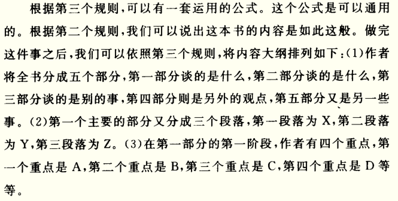

为了资讯而阅读还是为了增进理解而阅读。

阅读艺术：这是一个凭借着头脑运作，除了玩味读物中的一些字句之外，不假任何外助，以一己之力来提升自我的过程。

我们只能从比我们『更高杆』的人身上学习。

## 检视阅读

## 如何做一个自我要求的读者

一个阅读者要提出的四个基本问题：

+ 整体来来说，这本书到底在谈些什么？
+ 作者细部说了什么，怎么说的？
+ 这本书说得有道理吗？是全部有道理，还是部分有道理？
+ 这本书跟你有什么关系？

任何一个超越了基础阅读的阅读层次，核心就在于你要努力提出问题，然后尽可能寻找答案。

好好利用书本的空白页，记录上自己的阅读结果。

检视阅读要记下**结构笔记**：回答前两个问题。

## 阅读的第三个层次：分析阅读

**分析阅读规则一**：你一定要知道自己在读的是哪一类书，而且要越早知道越好，最好在你开始阅读之前就先知道。

### 实用性 vs 理论性作品

### 理论性作品的分类

如果一本理论的书所强调的内容，超乎了你日常、例行、正常生活的经验，那就是科学的书，否则就是一本哲学的书。

## 透视一本书

**分析阅读规则二**：使用一个单一的句子，或最多几句话来叙述整本书的内容。

**分析阅读规则三**：将书中重要篇章列举出来，说明它们如何按照顺序组成一个整体的结构。

**分析阅读规则四**：找出作者要问的问题，或者想要解决的问题。