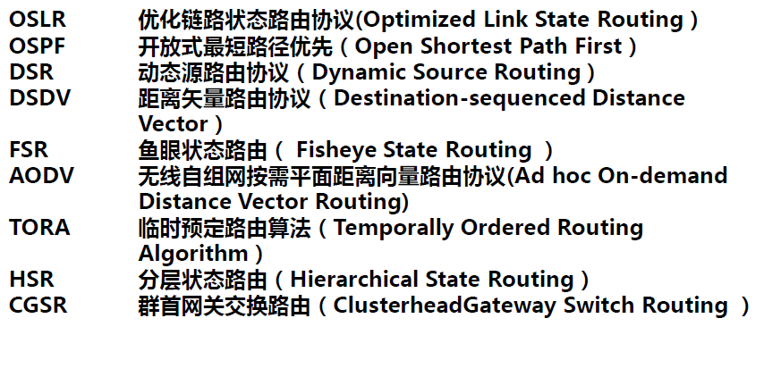
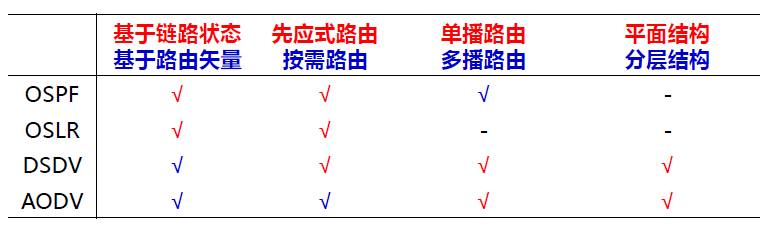
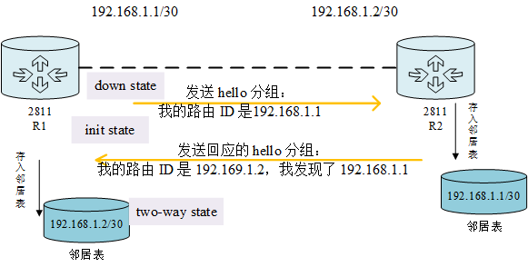
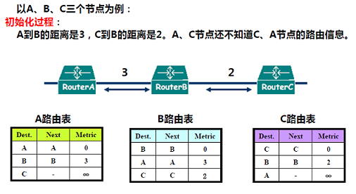
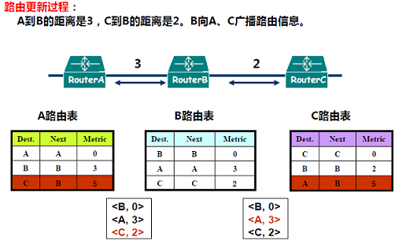
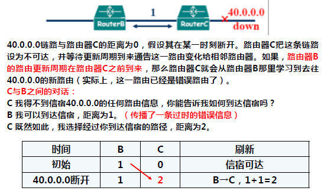
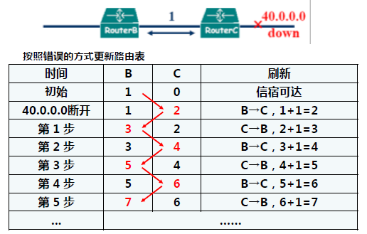
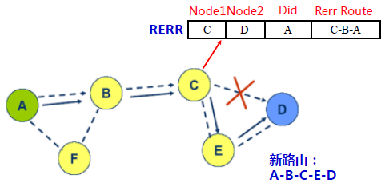
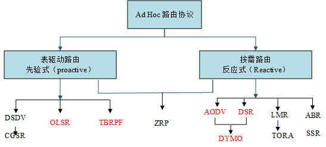

> 路，径之大者。
> 由，从也。

路由，即建立、选择与遵循路径。在网络中，路由就是分组从源节点到目的节点时，决定端到端路径的网络范围的进程。路由工作在 OSI 参考模型的第三层——网络层，它解决了信息传递时的路径选择问题。
<!-- more -->

## 1. 路由协议引论

路由回答了从出发点到达终点如何走的问题，以及如何走消耗的资源最少。

### 1.1. 传统路由

在详细介绍 Ad-Hoc 中的路由协议之前，我们需要了解下传统路由，需要注意的是它与 Ad-Hoc 中的有所不同，这是由于 Ad-Hoc 的特点与传统网络有很大区别。在传统路由中，主机与路由器是分开的，主机需要通过路由器连接到网络中，路由工作由路由器实现。具体来看传统路由的建立过程如下：

+ 发送端发出指令经路由器转发到达接收端；
+ 路由器收到数据包后，解析目的节点，随后根据路由表寻找下一跳路由器节点；
+ 一旦连接主机的路由器无法工作，将导致链路中段。

### 1.2. Ad-Hoc 网络中的路由

Ad-Hoc 网络有其自身无中心等特点，导致其路由有如下特点：

+ 网络中的终端兼有主机和路由两种功能，网络拓扑改变仍然额可以组网；
+ 每个终端都存有自己的路由表；
+ 网络中的单个链路中断或终端的变化不会对整体造成影响；

Ad-Hoc 网络路由也面临着一些问题：

+ 动态变化的网络拓扑，这将导致网络中路由表的频繁更新，常规的路由协议无法处理这种情况；
+ 单向信道的存在，这点与常规路由路由协议需要处理的问题大不相同，它会造成认知的单向性、路由的单向性和信息不可达；
+ 传输带宽有限；
+ 无线移动终端的局限性。

### 1.3. 路由的分类

在深入了解路由协议之前，下面先来对路由协议进行分类。我们需要关注的是分类的原则而不是分类的结果，关注这些原则对我们的理解大有好处，也许现在我们不太理解为何如此划分，当对它有一定的了解之后，回过头再来看就会理解的。

+ 按照路由协议依据
	+ 基于链路状态的路由协议
	+ 基于距离矢量的路由协议
+ 按照路由建立的方式
	+ 先应式路由协议
	+ 按需路由协议
+ 按照网络逻辑结构
	+ 平面结构的路由协议
	+ 分层结构的路由协议
+ 按照路由协议适用的网络规模
	+ 中、小规模自组网的路由协议
	+ 大规模网络的路由协议
+ 其他类型
	+ 主要是专门用途的路由协议，如基于地理信息的路由协议 LAR 和 GPSR 等。

按照这种划分，我们在这里只介绍按照第一种划分方式（按照路由协议依据）和第二种划分方式（按照路由建立的方式）下的一些典型的路由协议。

## 2. 链路状态与距离矢量路由协议

### 2.1. 链路状态路由协议

该协议下，基于链路状态，汇总区域内所有的路由器的链路状态信息。根据状态信息生成网络拓扑结构，每一个路由器再根据拓扑结构计算出路由。
对链路状态路由协议，我们通过一个典型的协议来研究，它就是 OSPF（开放式最短路径优先）协议。

OSPF 协议是一种典型的链路状态路由协议，**基于 IP**，采用 **Dijkstra 算法** 计算节点间的最短路径，它将链路状态广播数据包传送给区域内的所有路由器，区域内路由器共同维护同一张完整的网络图，保存在数据库中，每条记录都代表网络的一条从当前节点到其他节点的最短路径。

OSPF 工作分为如下三个过程：邻居表的建立，拓扑表的建立，计算路由。

#### 邻居表的建立

一台新加入 OSPF 区域的路由器首先要和邻居表建立邻接关系。

1. 加入进来后，它会主动向其他路由广播 hello 分组，介绍自己
2. 发送第一个 hello 完毕后，它会在四个 hello 的时间内等待应答，这被称为路由器的 **初始状态**。
3. 网络中的其他路由器收到它发来的 hello 后，将它的信息加入到数据库中，并回应 hello 分组。
4. 新路由器看到自己的 ID 出现在其他路由器应答的 hello 中时，就建立了邻接关系，将自己的状态改为双向。

#### 拓扑表的建立

此阶段依次涉及如下四个状态，经过这四个阶段后，此OSPF区域的所有路由器的数据拓扑图都达到了同步。

1. exstart state：其中一台路由器成为主路由器，两个邻居根据接口的IP地址的大小来确定主/从关系，主路由器负责发起通信。
2. exchange state：OSPF让每一个路由器和相邻路由器交换己有的链路状态摘要信息（邻接节点间发送 DBD，Database Description）。接收之后，与自己的拓扑表进行比较。找出自己所需要的信息。
3. loading state：经过与相邻路由器交换摘要信息后，新路由器需要更详细的信息（邻接节点间发送 LSR，Link State Request）。经过一系列的分组交换，全网同步的链路数据库就建立了。
4. full state：收到邻居发送的链路状态信息并更新和同步拓扑数据库后邻居便处于完全邻接状态。

#### 计算路由

在前一阶段，各个节点都有了全网的拓扑信息。在此阶段，每个路由器按照产生的全区域数据拓扑图（保存在它们的 LSDB 中），再运行 Dijkstra 算法，产生到目标网段的路由条目。

关于 Dijkstra 算法，这里不介绍了，详细可参考 [Dijkstra算法](https://blog.csdn.net/qq_35644234/article/details/60870719)。

### 2.2. 距离矢量路由协议

该协议下具有如下特点，路由器直接传送各自的路由表信息。网络中的路由器从自己的邻居路由器得到路由信息，并将这些路由信息连同自己的本地路由信息发送给其他邻居，这样一级级的传递下去以达到全网同步。每个路由器并不了解整个网络拓扑。

距离矢量路由协议和链路状态协议的设计思想都被引用在 Ad-Hoc 等很多网络中。距离矢量（distance vector, DV）路由算法是动态路由算法，在该算法下，每个路由器维护一张矢量表，表中列出了当前已知的到每个目标的最当距离，以及所使用的线路。通过邻居之间相互交换信息，路由器不断更新它们内部的表。

+ 路由度量：路由度量采用距离，距离表示本节点到达目的地址所需要的费用。这个距离可以是跳数，或队列长度，或时延；
+ 网络信息发布：周期性的向相邻节点进行广播，发布的内容直接来源于本节点的路由表。经过相互的交换，每个节点可获得网络所有节点的距离信息；
+ 路由选择：基于所获得的距离信息，以最短距离为标准，选择到信宿的下一跳节点；
+ 路由表：每个节点维护一个路由表，表项包括信宿地址、到信宿的下一跳、到信宿节点的费用等；

Ad-Hoc 网络中距离通过跳数体现，矢量就表现为下一跳的节点是谁。路由器之间广播自己的路由表中的信息，更具体将 Next 和 Metric 广播出去，广播的同时自己的位置天然携带了。接收到信息的其他路由器根据需要更新自己的路由表。从下图中的例子展示了细节。

看起来很好，不过这种算法却没有在 Ad-Hoc 直接被使用，因为它会带来路由环路问题。下面这个例子展示了这个问题。

在维护路由表信息的时候，如果在拓扑发生改变后，网络收敛缓慢产生了不协调或者矛盾的路由选择条目，就会发生路由环路的问题。这种条件下，路由器对无法到达的网络路由不予理睬，导致用户的数据包不停在网络上循环发送，最终造成网络资源的严重浪费。

通过一定的调整对 DV 算法进行改进，我们可以解决路由环路问题，一般而言，有如下常见解决方案：

+ 定义最大跳数：设置最大跳数为 16，超过 16 的，网络视为不可达；
+ 水平分割：路由器从某个接口学到的路由，不会从该接口再发回给邻居路由器；
+ 触发更新：当路由信息发生变化时，立即向邻居设备发送触发更新报文；
+ 路由毒化：在路由信息在路由表中失效时，先将度量值变为无穷大，再向邻居路由发送相关路由更新信息。

## 3. 主动路由协议

该协议下，无论是否有通信需求，每个节点周期性广播并交换路由信息，维护一张包含到其他节点的路由信息的路由表，也被称为前摄式路由协议。这种协议下，节点主动发送路由更新包，故也叫作主动路由协议，包括RIP协议、DSDV协议、OSPF协议等。

这是一种传统的分布式最短路径路由协议，不难发现它有如下特点：每个节点维护到网络中所有节点的路由，所有路由都已经存在且随时可用，路由请求的延迟低，但路由开销高。

我们以 DSDV（Destination Sequenced Distance Vector，目的序列距离矢量）路由协议为例，来看看主动路由协议的细节。

### 3.1. DSDV 工作原理

DSDV 是一种基于 Bellman-ford 算法的距离矢量路由协议，采用序列号机制来区分路由的新旧程度，防止可能发生的路由环路。

#### 路由信息格式

每个节点维护一张距离-矢量表，表中列出所有可达的目的节点及到达该目的节点的跳数，同时每条路由条目包含目的节点产生的序列号，用来区分新旧路由。我们先来看看 DSDV 协议下的路由表格式，将其与 DV 协议对比，注意其改进之处。

| Destination | Next Hop | Metric | Seq.No | Install Time |
| :---------: | :------: | :----: | :----: | :----------: |
|      A      |    A     |   0    | S550_A |    001000    |
|      B      |    B     |   1    | S102_B |    001200    |
|      C      |    B     |   3    | S588_C |    001200    |
|      D      |    B     |   4    | S312_D |    001200    |

各列的含义如下：

+ Destination：目的节点地址；
+ Next Hop：下一跳节点地址；
+ Metric：从该节点到目的节点的路由的跳数；
+ Seq.No：目的节点序列号，是偶数，由目的端产生，防止出现路由环路，并确保路由信息是最新的，记作 SNNN_Dest；
+ Install Time：记录路由建立的时间，用于删除过期的路由。

如上所示为路由条目信息，注意到在更新路由条目时，遵循两个原则：序列号新和度量值小。将更新信息和节点的路由表对比，选择序列号值大的路由信息，这样就能保证到达目的节点的路由信息是最新的。当序列号值相等时，选择度量值最佳（例如最小跳数）的路由信息。

#### 信息公告

各节点周期性的向邻居节点通告其当前的路由表，而不是采用洪泛法。这意味着各节点对收到的其他节点的信息进行处理以后再进行广播通告，大大减少了通过的信息量。后面我们还会讲到洪泛法，注意区分。

为了进一步减少路由信息的传输开销，DSDV 中使用了两类更新报文。第一种是完全转存，将路由表项中的所有信息进行通告。第二种是递增更新，仅通告更新信息。

举几个例子来说明如何公告：

1. 广播更新的路由表：当节点的路由表更新后，它会同时更新以自己为 Dest 的路由条目的序号。它向周围广播的路由表时，会包括自己的已更新的序列号信息。
2. 新节点的加入：新节点 D 加入网络后，会进行广播，接收到的信息的节点  C 会更新自己的路由表，然后向周围的节点广播更新的路由表。值得注意的是，C 在更新路由表时不止增加 D 的路由条目，同时会更新以自己为 Dest 的路由条目的 Seq.No。
3. 链路断：如果在相当长的一段时间内不能收到相邻节点的广播消息，可推断出链路断。DSDV 下，断的链路度量值等于无穷。下一跳经过该链路的路由表项的度量值表为无穷，并分配一个新的序列号，且为奇数。出现无穷项时，立即触发递增更新报文发送，将链路断裂信息通告到全网。
举个例子，节点 C 检测到链路断裂，序列号增加 1，然后其邻居更新路由表。注意若 B 在 C 发送更新报文前，发送了断裂链路的更新报文，那么由于其序列号小 1，不会触发 C 进行更新，也就避免了路由环路。

#### DSDV 的优缺点

DSDV 协议基于 DV 算法，简单易实现，因只需和邻居节点交换路由信息，需要的存储空间小。而且我们可以看到，DSDV 解决了路由环路问题，且能对拓扑变化作出快速反应。再次强调，它是一种先验式（表驱动）路由。总结其优缺点如下。

#### 优点

+ 简单
+ 无路由环路问题
+ 无路由发现延迟

#### 缺点

+ 所有节点都必须公告路由，因此不支持休眠
+ 收敛慢（距离矢量路由的特性）
+ 开销大，大部分的路由信息从不使用
+ 可扩展性是一个主要问题

## 4. 按需路由协议

介绍完主动路由协议，我们再来看看按需路由协议。

当需要一条从源节点到目的节点的路径进行数据发送时才查找路由。节点并不保存整个网络的及时准确的路由信息。当源节点要向目的节点发送报文时，源节点在网络中发起路由查找过程，找到相应的路由后，才开始发送报文。也被称为后验式。

### 4.1. 动态 DSR 协议

DSR 是最早采用按需路由思想的协议，它采用了源路由的路由机制，在每一个分组的头部都携带整条路由的信息，路由器按照该路由纪录来转发分组。

DSR 协议使用源路由，采用 Cache（缓冲器）存放路由信息，且中间节点不必存储转发分组所需的路由信息，网络开销较少，却因此存在陈旧路由。

#### 4.1.1. 路由发现

当一个节点欲发送数据到目的节点时，它首先查询路由缓冲器是否有到目的节点的路由。如果有，则按此路由发送数据；如果没有，源节点就开始启动路由发现程序。路由发现过程中使用洪泛路由（Flooding Routing）。

当节点 S 需要向节点 D 发送数据，但不知到节点 D 的路由于是节点 S 就开始路由发现过程。源节点 S 洪泛『路由请求』分组 Route Request(RREQ)，每个请求分组通过序列号和源节点 S 标识唯一确定。

##### 路由请求

源节点向邻居节点广播路由请求（RREQ）消息，RREQ 的格式及含义如下所示。

其中，Sid 为源节点 ID 号，Did 为目的节点 ID 号，Route record 是路由记录，记录了从源节点到目的节点所经过的节点序列，Request ID 为路由请求序列号，由源节点设置。

当一个节点收到 RREQ 时，如果该节点满足：

1. 不是目的节点D；
2. 请求分组头部的源路由序列中不包含该节点；
3. 没有接收过同样的路由请求分组；
4. 且路由表中没有目的节点D的路由信息。

那么节点将自己的地址附加到『路由请求』分组头部的 Route record 中，并将该分组转发给所有相邻节点。

##### 重复检测

上面提到的第 2、3 点其实就是对 RREQ 重复的检测，这种检测是为了避免路由环路问题。我们再次重复一下这个 RREQ 重复的检测：如果（1）节点接收到的RREQ消息中的 <源节点地址、请求 ID> 存在于本节点的序列对列表中，或者（2）如果节点接收到的RREQ消息中的路由记录中包含本节点的地址，那么我们认为这个 RREQ 是重复的，将它丢弃。

##### 路由应答

当 RREQ 分组最终传递到目的节点 D 时，D 会往回发送 RREP 分组，分组的格式如下：

其中，Did 表示目的节点 ID 或者说是请求路由分组的源节点 ID，Date Route 表示启动路由请求的源节点发送的数据分组要经过的路由（节点序列），而 Reply Route 是路由应答分组 RREP 所要经过的路由（节点序列，不难发现将 Date Route 反向即可）。

##### 获得新路由的方式

节点在转发 RREQ 时也会获得到源节点的，如 E 转发来自 C 的 RREQ（A-B-C），它就会获得到 A 的路由（E-C-B-A）。

节点也会监听相邻节点发送的分组（包括 RREQ，RREP，数据分组），查看需要的路由信息。

节点转发 RREP 时，获得到目的节点的路径上的所有节点的路由。

节点转发数据分组时，获得从本节点到源节点的路由。

##### 路由缓存

当源节点 S 接到 RREP 分组后，就将 RREP 分组中从源节点 S 到目的节点 D 的路由信息进行缓存；当源节点 S 向目的节点 D 发送数据分组时，此路由信息就包含在每个分组的头部。所有的中间节点利用源路由信息进行分组转发。

#### 4.1.2. 路由维护

##### 路由缓存的优化

当中间节点的缓存中包含到目的节点的路由时，就由这个中间节点发送 RREP 给源节点，这将缩短路由寻址时间。

但是，这种优化也会带来问题。

##### 错误路由缓存

网络拓扑的变化使得缓存的路由失效。影响和感染其它节点，使用该路由缓存的路由将不可用；当节点根据路由缓存回应 RREP 时，其它监听到此 RREP 的节点会更改自己缓存的路由，从而感染错误路由缓存。对于这种问题，我们可以设置缓存路由的有效期，过期删除。

##### RREP 风暴

当某个节点广播某个目的节点的 RREQ 时，当其邻居节点的路由缓存中都有到该目的节点的路由时，每个邻居节点都试图以自己缓存的路由响应，由此造成 RREP 风暴。RREP风暴将浪费网络带宽，并且加剧局部网络冲突。

为解决这个问题，让所有欲发送 RREP 的节点，先延时 D，再发送。`D=H*(h-1+r)`，其中 H 是每条链路的传播延时，h 是自己返回的路径长度即到目的节点的跳数，r 是 0 或者 1。可以看到，D 与节点到目的节点的跳数成正比，使得到目的节点的最短路径的 RREP 最先发送。同时，所有的节点都设置成混杂模式，监听是否存在比自己更短的到目的节点的路径，如果有，就不发送本节点的 RREP。

##### 路由故障分组 RERR

如果中间节点发现路由表中显示的下一跳节点链路层不可到达，向源节
点发送一个RERR。源节点从路由缓冲条目中删除所有不可到达的链路（这条路径的中间节点也利用这个信息更新路由缓冲器） 。源节点将重新启动新的路由发现过程。RERR 的格式如下：

其中 Node1 表示链路出错的一端节点 ID 号，Node2 是链路出错的另一端节点 ID 号，Did 表示目的节点 ID 或遇到链路出错的数据分组的源节点 ID ，Rerr route 是路由出错分组所要经过的路由（节点序号）。

下图展示了一个例子，从中我们可以看出 RERR 是如何工作的。

#### 4.1.3. DSR 总结

从上面的描述中，我们不难发现 DSR 协议的特点，这里再对其进行一个总结，它具有如下优点：

+ 采用源路由机制、避免了路由环路；
+ 它是一种按需路由协议，只有当两个节点间进行通信时，才会缓存路由纪录；
+ 因此相对主动路由来说，减小了路由维护的开销；
+ 通过采用路由缓存技术，减少路由请求信息对信道的占用。

虽然 DSR 存在一定的缺陷，但是也有一些解决办法，一并列出来。

+ 随着路经跳数的增加，分组头长度线性增加、开销大；
+ 路由请求分组 RREQ 采用洪泛发向全网扩散，导致网络负荷大；
+ 来自邻居节点的 RREQ 分组在某个节点可能会发生碰撞，解决
  办法是：在发送 RREQ 分组时引入随机时延；
+ 当源节点发送路由请求分组 RREQ 时，可能会收到多个节点缓
  存的到达目的节点的路由信息，引起竞争。解决办法：若某节
  点听到其它节点发出的 RREQ 分组中路由信息含有较少跳数，
  此节点停止发送。
+ 当源节点发送路由请求分组 RREQ 时，可能会收到多个节点缓
  存的到达目的节点的路由信息，但有些路由信息可能是过时的。解决办法：引入定时器、链路断的情况应进行全网洪泛。

### 4.2. AODV 协议

AODV，Ad Hoc on demand distance vector，按需距离矢量路由协议。

AODV 在 DSR 的基础上进行了一些改进，在 AODV 中，参与通信过程的节点需要维护路由表，那些不再路径上的节点不保存路由信息，数据分组不需要包含从源到目的节点的路由信息，即采用逐跳转发分组方式。

AODV路由协议是为Ad hoc网络节点设计的，它提供对动态链路状况的快速自适应、处理开销和存储开销低、路由开销低、确定到达 Ad Hoc 网络内目的节点的单目标传输路由。

AODV 有四种基本的报文：RREQ（路由请求帧），RREP（路由应答帧），RERR（路由错误帧），HELLO（活跃路由链路监测帧）。

#### 4.2.1 AODV 路由表

路由请求发送 RREQ 过程建立反向路由表，转发 RREP 时建立正向路由表，路由维护时更新路由表。路由表主要构成如下：

1. 目的节点地址 n_dst：用于标志使用此路由的最终目的节点，决定了数据分组转
    发方向。
2. 目的节点序列号 rt_seqno：反映此路由的新鲜度，一般序列号越大路由越新鲜，
    这是保证开环的重要措施，在路由发现和路由应答更新路由时需要进行序列号的
    比较。
3. 路由状态标志 rt_flags(有效、无效、正在修复等)：反映此路由目前的状态，主要
    用于告知数据分组经过此节点的时候处理方式。
4. 网络接口 rt_interface：移动节点访问信道的接口
5. 跳数 rt_hops：到达目的节点所需要的跳数。
6. 下一跳rt_nexthop：：数据分组经过本节点之后，数据分组将被直接转发的中继
节点，通常下一跳节点应该出现在当前节点的邻节点列表中。
7. 前驱节点列表 rt_pcliSt：使用这条路由的所有直接前驱节点列表。
8. 路由生命期 rt_expire：路由有效的生命期，在数据分组转发使用当前路由时会更
新路由的有效生命期，当较长时间不使用此路由时，此路由的有效期将会过期，
在路由管理时将会使路由失效。

网络中的每个**节点维护自身的序列号**，它表征了路由的新旧。节点在发生路由请求时，会先增加自己的序列号，再发送，发送的 RREQ 中会携带自己的序列号。目的节点只接受最新的序列号，这样一来就可以避免路由环路问题。

#### 4.2.2. 路由建立

简单概括成以下几个过程：

+ 源节点广播路由请求帧 RREQ；
+ 中间节点转发 RREQ，转发过程类似 DSR 协议；
+ 当目标节点接到 RREQ 分组时，它回应 RREP 分组，RREP 沿着方向路径传输。

源节点 S 打算向目的节点 D 发送一个数据包，在路由表中未查找到能到达D的路由，向其邻居广播 RREQ 分组用于路由发现。为避免节点重复接收处理 RREQ 消息，用源节点和路由请求编号的组合唯一标识一个 RREQ 请求。

接收到RREQ的节点作如下处理：中间节点更新各自到源节点S的路由表，记录并维护指向源节点的反向路由；设置到源节点路由表的『过时定时器』。

如果收到 RREQ 的节点不是目的节点，更新 RREQ 分组（将 RREQ中 的信宿序列号设为节点收到的该信宿 D 相关的最大序列号，跳计数加1），并转发更新后的 RREQ 分组。如果在『路由发现定时』内已收到一个具有相同标识的RREQ分组，则抛弃该分组，不作任何处理。

如果满足如下条件之一，则节点产生 RREP，并单播发送到源节点 S，否则继续广播 RREQ，且表项的序列号大于 RREQ 中的信宿序列号。

+ 该节点就是目的节点D，；
+ 节点的路由表中有到目的节点D的活动表项。

转发 RREP 的中间节点创建『前向路由表』并更新，记录转发路由的下游节点、跳数、生存时间、目的序列号等内容；将跳计数加 1，并根据先前记录的反向路由将 RREP 报文转发给上游节点。上游节点收到RREP后按照相同规则更新路由表并转发 RREP，直至源节点 S。

#### 4.2.3. 路由维护

AODV的路由也同样存在过期问题，因此参与通信的节点，需要维护路由表。通过设一个定时器，当超过设定时间时，则认为路由表中的反向路径信息无效。

AODV链路状态检测机制，活跃路径节点以HELLO_INTERVAL为周期发送HELLO，用来保持联系，当在设定的时间内，如果没有来自路由表中的前向路径的HELLO，则认为前向路径信息失效（即使路由信息是可用的）。

与活动路由无关的节点移动，并不影响信源到信宿的寻径。

如果信源节点移动导致路由不可用，则由信源重新发起路由发现的过程。

当由于信宿节点或活动路由的中间节点移动等原因导致链路中断链路的『上游节点』主动发送一个 RERR，该 RERR 的信宿序列号大于其所储存的信宿序列号，并传播到所有的邻居，邻居节点会继续转发 RERR 分组。其他节点收到RERR分组后，更新路由表（将包含e的链路设为无效），并继续转发RERR分组。该过程不断重复，直至所有的相关节点被通告到。

中间节点收到发送到目的节点的数据包时，如果发现到达目的节点的路由失效，该中间节点可以缓存该数据包，并发起到目的节点的路由请求，等待路由重新建立后再据需发送数据包。

#### 4.2.4. AODV 总结

优点：传统的距离向量路由机制；支持中间节点应答，能使源节点迅速获得路由，有效减少了广播数，但存在过时路由问题；节点只存储需要的路由，减少了内存的需要和不必要的复制；快速响应路径上的断链，避免路由环路；具有网络的可扩充性；

缺点是路由建立时延较大。

## 5. 主动路由协议与按需路由协议

主动路由协议是按路由发现和建立路由方式的角度分类下的一种路由协议，也叫表驱动路由协议，与之相对的是按需路由协议，前面介绍的两种路由协议 OSPF、DSDV 均属于主动路由协议。

主动路由协议的特点：

+ 传统的分布式最短路径路由协议，基于链路状态或者距离向量，所有节点连续更新『可达』信息；
+ 每个节点维护到网络中所有节点的路由；
+ 所有路由都已经存在并且随时可用；
+ 路由请求的延迟低；
+ 路由开销高。

按需路由特点：

+ 在源端需要时候通过路由发现过程来确定路由控制信息采用洪泛（flooding）方式，路由请求延迟高，路由开销低；
+ 两种实现技术：源路由（报文头携带完整的路由信息）和逐跳路由（类似现有的Internet路由）。

由于他们建立的方式不同，在应对不同的场合他们会有不同的效率表现。主动协议因全程维护所有的路由而具备低延迟；按需协议因只在需要时才发现所需路由而导致高延迟。主动协议因连续更新路由可能导致高开销；按需协议因只在需要时才维护路由而具备低开销。

具体选择哪种类型的路由取决于业务负载和节点的移动模式（是否频繁移动）。