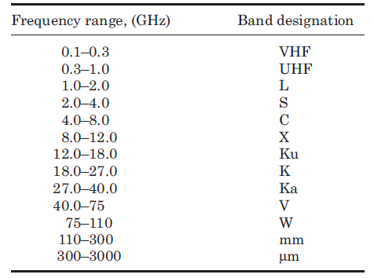
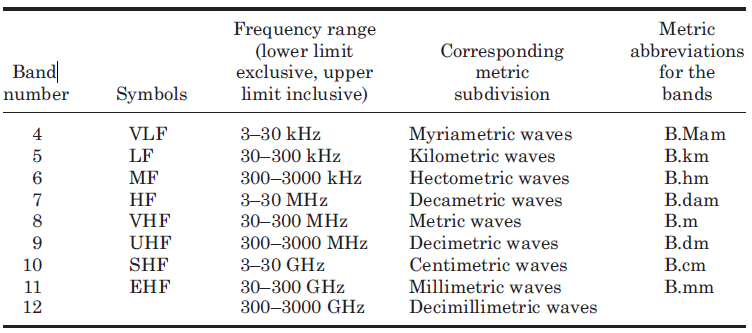

卫星通信课的笔记，持续更新。
<!-- more -->

## 1. Overview of Satellite Systems

### 1.1. Frequency Allocations

频率资源非常紧张，国际上由 ITU ( International Telecommunication
Union ) 同一管理分配。在卫星通信中，为了更好地对频率资源进行管理，将世界分成三个区域。

+ Region 1: Europe, Africa, what was formerly the Soviet Union, and Mongolia
+ Region 2: North and South America and Greenland
+ Region 3: Asia (excluding region 1 areas), Australia, and the southwest Pacific

在区域内，全频带可使用。这些频率资源基本上是用于提供下面这些服务，当然它们也可以细分出很多内容，如 Mobile satellite services 中包含了 land mobile，maritime mobile 和 aeronautical mobile。

+ Fixed satellite service (FSS)
+ Broadcasting satellite service (BSS)
+ Mobile satellite services
+ Navigational satellite services
+ Meteorological satellite services

下表展示了常用的频带和它们的名称，这些都是常识。

还有一种 ITU 的频段划分方式，不在卫星通信中使用：

## 2. Orbits and Launching Methods

