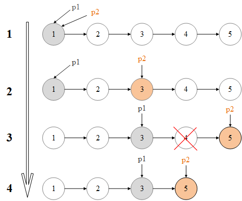

## 题目

给定一个链表，删除链表的倒数第 n 个节点，并返回链表的头结点。
<!-- more -->

### 示例

给定一个链表：`1->2>3->4->5`，和 `n=2`。当删除倒数第二个节点后，链表变为 `1->2>3->5`。

### 说明

给定的 `n` 保证是有效的。

## 解题

这个题使用双指针即可很快解决：

1. 初始化两个指针 `p1` 和 `p2` 均指向链表的头部
2. `p2` 不动，`p1` 指针向后滑动 `n` 个位置
3. `p1` 和 `p2` 一起向后滑动，当 `p1` 指向节点的下一个节点为空时，`p2` 指向的节点即为待删除节点的前一个节点，执行删除操作。
4. 返回头指针

使用 C 语言实现如下：

