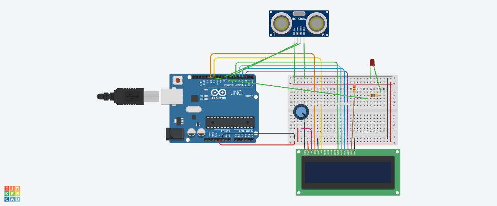

Distance sensor can be very useful in some conditons, such as obstacles detecting and avoiding. By using arduino, it's very easy for us to use distance sensor. This demo show us a simple example to use distance sensor. For better display, we will use LCD1602 to show the distance. **It's modified from example in arduino.**

<!-- more -->

## Supplies
+ Arduino uno R3
+ HC-SR04
+ Breadboard
+ LCD1602
+ Red LED
+ Spotter
+ Two 100 Ohm resistance
+ some DuPont lines

## Step 1 Design and connect circuit

Browsering internet, it's easy to find instructions of HC-SR04 and LCD1602. And there are so many libraries for us in arduino. In our circuit, arduino digital pin 2, 3, 4, 5, 11 and 12 are used for LCD1602 while digital pin 7 and 8 are for HC-SR04. LED uses digital pin 13. Finally, following is our circuits.

## Step2 Code

As we said before, our program is  based on libraries. So it's simple to write code. Later I will display complete code. 

Outside the loop, we define a function readUltrasonicDistance used for HC-SR04. Calling this readUltrasonicDistance, we get distance in centimeter. Inside the function setup, we initialize a LCD1604. In the loop, we get distance in centimeter by calling function readUltrasonicDistance. Then we clear LCD screen and print some characters and distance we just got. Finally, we turn on the LED if distance less than 90cm, or turn off the LED if not less than 90cm.

Here shows complete code.



## Summary

In this post, we show a demo to use distance sensor HC-SR04 and LCD1602. It's a good example to use the sensor. Also, there are many possible usages.