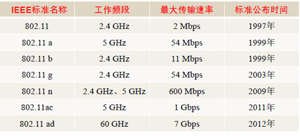
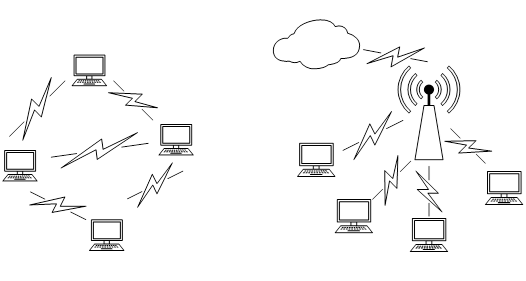
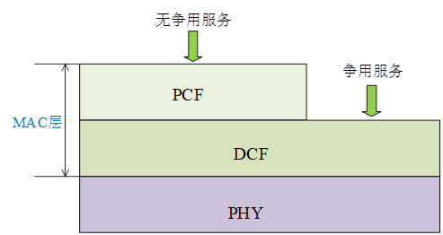
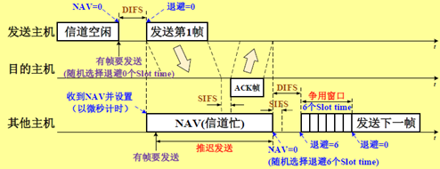

现在初步打算写无线局域网中MAC的接入技术，在知网简单搜索下，发现研究这个的还真不少，如[无线局域网中高效MAC层接入机制研究](https://kns.cnki.net/KCMS/detail/detail.aspx?dbcode=CMFD&dbname=CMFD201902&filename=1019113029.nh&uid=WEEvREcwSlJHSldRa1FhdXNzY2Z2S3F4L2xoUW9La0NoVFhnOE9GdXhpZz0=$9A4hF_YAuvQ5obgVAqNKPCYcEjKensW4ggI8Fm4gTkoUKaID8j8gFw!!&v=MjU0ODllWm9GQ3ZsVUwvSlZGMjZGN0s1SGRIT3BwRWJQSVI4ZVgxTHV4WVM3RGgxVDNxVHJXTTFGckNVUjdxZlk=)，[低时延高可靠无线局域网MAC增强技术研究](https://kns.cnki.net/KCMS/detail/detail.aspx?dbcode=CMFD&dbname=CMFD202001&filename=1020004190.nh&uid=WEEvREcwSlJHSldRa1FhdXNzY2Z2S3F4L2xoUW9La0NoVFhnOE9GdXhpZz0=$9A4hF_YAuvQ5obgVAqNKPCYcEjKensW4ggI8Fm4gTkoUKaID8j8gFw!!&v=MjYzMzBab0ZDdmxWcnpCVkYyNUhyTzRHdERGcjVFYlBJUjhlWDFMdXhZUzdEaDFUM3FUcldNMUZyQ1VSN3FmWWU=)和[工业无线局域网MAC协议确定性机制研究](https://kns.cnki.net/KCMS/detail/detail.aspx?dbcode=CDFD&dbname=CDFDLAST2020&filename=1019253781.nh&uid=WEEvREcwSlJHSldRa1FhdXNzY2Z2S3F4L2xoUW9La0NoVFhnOE9GdXhpZz0=$9A4hF_YAuvQ5obgVAqNKPCYcEjKensW4ggI8Fm4gTkoUKaID8j8gFw!!&v=MjA5NDlkYkVycEViUElSOGVYMUx1eFlTN0RoMVQzcVRyV00xRnJDVVI3cWZZZVpvRkN2a1dydlBWRjI2RjdHOUg=)。看起来写完这篇课程报告不是特别烦，基本上我觉得可以照着一篇硕士论文快速完成这篇课程报告，毕竟时间紧急，拿到该拿的分即可。写完后，我会在这里同步完报告的全部内容。
<!-- more -->

## 1. 无线局域网的发展历史

随着互联网业务的迅速发展，人们对各种在线服务的实时性需求日益强烈。相比蜂窝网，无线局域网网络有着高带宽，灵活以及廉价等诸多优势，目前，无线局域网（Wireless Local Area Network, WLAN）己经在家庭、校园、企业和城市公共场所等多种场景部署。

可以看到无线局域网已经广泛应用于我们的日常生活，这是由于其传输速率高、带宽配置灵活、使用非授权频段以及方便灵活部署等优势。无线局域网的代表协议是IEEE 802.11系列标准，第一个IEEE 802.11 标准于1997年发表，至今已有 23 年历史了[1]。二十年来，802.11取得了很大的发展，很多新技术进入了标准，推动 802.11 协议日趋完善。

1997年，IEEE推出了第一个无线局域网标准——IEEE 802.11，其中定义了介质访问控制（MAC）层和物理层。物理层定义了工作在2.4GHz的ISM频段上的两种扩频作调制方式和一种红外线传输的方式，总数据传输速率设计为2Mbit/s，MAC层采用的CSMA/CA技术。

EEE 802.11a协议[2]在1999年被标准化，它采用的是正交频分复用技术（Orthogonal Frequency Division Multiplexing, OFDM），工作频率为5GHz，使用52个正交频分多路复用子载波，最大原始数据传输率为54Mb/s，达到了现实网络中等吞吐量（20Mb/s）的要求。

同年IEEE 802.11b被正式批准，该标准规定无线局域网工作频段在2.4GHz，由于工作频段更低，与IEEE 802.11a相比，它的工作范围更大，但速率更低，数据传输速率达到11Mbps。该标准是对IEEE 802.11的一个补充，采用点对点模式和基本模式两种运作模式，其数据传输速率可以根据实际情况在11Mbps、5.5Mbps、2Mbps、1Mbps的不同速率间自动切换，802.11b和工作在5GHz频率上的802.11a标准不兼容。由于价格低廉，802.11b产品已经被广泛地投入市场，并在许多实际工作场所运行。

2003年7月IEEE 802.11工作组批准了IEEE 802.11g草案，在2.4GHz频段使用正交频分复用技术，使数据传输速率提高到20Mbit/s以上；可与IEEE 802.11b的Wi-Fi系统互联互通，可共存于同一AP的网络里，从而保障了后向兼容性。

IEEE 802.11 n在2009年标准化，采用了OFDM和4x4多入多出（Multiple-Input Multiple-Output, MIMO）技术[3]，物理层速率可以在两路20MHz信道(共40MHz )中达到600Mbps。

2013推出的IEEE 802.11ac协议利用OFDM和8x8 MIMO技术[4]，在8个20MHz信道(共160MHz)中，物理层速率可达到6.9Gbps，在802.11n基础上有了很大的提升。最新的 802.11ax 标准已经支持160MHz的带宽，8条流空间复用，基于 OFDMA的多址接入技术提高了信道利用率，满足密集部署场景的应用需求[5]。其他更多标准的简略信息如图1-1所示。	

我们可以看到，无线局域网标准定义了协议的工作频段、调制编码方式及最高速度的支持。可以看到，无线局域网的工作频段是2.4GHz和5GHz，前者的具体范围是2.4000～2.4835GHz，后者是5.15～5.825GHz，通常设计工作在2.4GHz频段的协议支持的数据传输速率低一些，但覆盖范围大，工作在5GHz频段的协议支持的数据传输塑料布高一些，但覆盖范围小。从调制技术来看，无线局域网的物理层从CCK向OFDM和MIMO-OFDM发展，支持的传输速率越来越大，2Mbps，54Mbps，600Mbps，1Gbps，9.6Gbps，传输速率是越来越大，当然其中消耗了更多的带宽资源。

## 2. 无线局域网的MAC层

### 2.1 无线局域网的两种网络结构

IEEE 802.11定义了无线局域网的两种网络结构，分别是无中心网络（Ad hoc模式）和有中心网络。在Ad hoc模式下，网络中没有中心站点，各站点式平等的，这是一种对等式网络（Peer-to-Peer，P2P），有中心网络的网络结构中有一个中心站点，又称接入点（Access Point，AP），也叫做AP模式。两种结构的示意图如图2-1所示。

目前，AP模式是比较常用的，我们在家中使用的WiFi就是这种模式，而Ad hoc一般在一些专用场合使用，平时比较少见。

### 2.2 无线局域网的MAC层结构

在无线局域网中，无线信道由多个站点共享，它们同处于一个冲突域下，在这种情况下，最需要解决的一个问题就是如何避免站点数据的碰撞，否则站点的数据会发生相互干扰，导致接受站点无法正确接收到信息。这个时候我们就需要一个控制各站点接入无线信道的协议来统一管理，这就是我们的MAC层协议。

MAC层即介质访问控制层，在传输帧时，一个基站首先要获取共享信道的访问，无线局域网的标准定义了两种介质访问控制方式：分布式协调功能（DCF）和集中式协调功能（PCF）。其中DCF功能是必须支持的，而PCF则不一定。MAC的结构如图2-2所示。

DCF机制是IEEE 802.11协议采用的基于竞争的MAC机制，其采用载波监听多址接入/冲突避免（Carrier Sense Multiple Access mechanism with Collision Avoidance，CSMA/CA）和二进制指数退避（Binary Exponential Back-off，BEB）两种基本机制可以为多个站点提供信道接入，各个站点在这种机制下对信道资源进行争用，有可能会发生数据碰撞。

PCF是MAC的可选用功能，在PCF下，各站点不需要争用信道，信道资源由AP统一分配，这种工作模式下，不会发生数据碰撞。但是一般情况下这种方式使用较少，只有在对传输时间要求高的视频、音频会话类应用时，才会启用PCF方式。

### 2.3 无线局域网的MAC层接入机制

当前，IEEE 802.11MAC协议中广泛采用的接入方法是CSMA/CA。CA的意思是冲突避免，无线局域网发送结点监测到无线信道“空闲”时不“立即”发送帧，而是所有准备发送数据帧的主机都执行退避算法，通过“冲突避免”（CA）来减小冲突发生概率，而且无线局域网发送结点需要等待接收结点发送回确认帧，来判断此次发送是否成功。

#### 2.3.1 常用帧间间隔

网络中的无线网卡在检测到信道空闲时到真正发送一帧时，或发送一帧之后到发送下一帧时，都需要间隔一个帧间隔（Inter Frame Space，IFS）时间。IEEE 802.11协议规定了4种帧间间隔：

（1）短帧间间隔（Short IFS，SIFS）
固定值，是最小的帧间间隔，只有在等待一个SIFS后才可能发送ACK帧、CTS帧。

（2）分布协调功能帧间间隔（Distributed coordination IFS，DIFS）
DIFS比PIFS长一个时一隙时间。它只能工作在DCF模式，主要用于在每次通信中的第一帧之前。

（3）点协调功能帧间间隔（Point coordination IFS，PIFS)
PIFS比SIFS长一个时隙时间(slot time )，又称集中协调功能帧间间隔。它只能工作在PCF模式，用于在开始使用PCF功能时，使站点能够尽快获得发送权。

（4）扩展帧间间隔（Extended coordination IFS，EIFS）
EIFS是最长的IFS，主要用于在前一帧出错的情况下，发送站点必须延迟EIFS，而不是正常情况下的DIFS时间后，再发送下一帧

#### 2.3.2 CSMA/CA原理

CSMA/CA的设计目标是为了尽可能减少冲突发送概率，简单概括其基本原理就是信道监听，推迟发送和冲突避免。信道监听通过物理层对无线信道进行载波监听，ACK确认，推迟发送采用虚拟载波监听（Virtual Carrier Sense，VCS）与网络分配向量（Network Allocation Vector，NAV）机制，冲突退避采用DIFS和二进制指数退避算法。

CSMA/CA有两种工作模式，基本模式和可选的RTS/CTS预约模式，后者可以解决隐藏主机带来的冲突问题。这里只介绍基本模式，它的信道接入过程如图2-3所示。

NAV起到一个计时器的作用，其数值由发送主机在帧头的“持续时间”字段广播给其他主机，对于其他主机，只有当检测到NAV=0时才认为信道是空闲的。如果检测到信道空闲，那么发送主机需要等待一个DIFS，然后随机退避n个slot time才能发送数据帧，这个时候的数据帧就携带了此次发送站点的NAV信息，提醒其他站点信道繁忙，让其他站点保持静默以免发送碰撞。退避时间由二进制指数退避算法决定，退避时间为
$$
W = (2^{2+i}-1)\cdot W_s
$$
第i次退避时，从 $2^{i+1}-1$ 个slot time中随机选取一个作为退避时间，如果在退避时，检测到NAV不为0，这表示其他站点开始发送帧，此次竞争失败，则冻结当前退避时间，直到NAV=0并等待DIFS后继续从刚才冻结的退避时间开始倒数。从上述的描述我们可以看到，帧立即发送的条件为：NAV=0并且经过DIFS并且退避时间=0。

接收主机（AP模式下即为AP）收到数据帧后，等待SIFS，才能向发送主机发送ACK确认帧，发送主机收到后，一次帧发送才算完成。

从前述对CSMA/CA的分析我们不难发现，这种机制在AP连接的站点数目较少时性能才比较好，因为此时站点退避的时间相同的概率比较小，发生冲突的概率小，但如果AP接入的站点很多，那么碰撞的概率增大，网络的性能变差。针对这种情况，对其进行改进的研究也很多，我们在后面进行介绍。

## 3. 无线局域网的MAC层接入技术的改进

前面谈到，传统的无线局域网MAC接入技术基于CAMA/CA和BEB机制，在这种机制下，如果网络中接入的站点比较多，数据发生碰撞的概率会增大，极端情况下，如果接入的站点特别多，没有站带你能够向AP发送数据，也就是说在密集组网的情况下，传统的MAC层接入技术有许多需要改进的地方。

### 3.1 初始竞争窗口值的改进

在CSMA/CA和BEB协议中，一些参数如初始竞争窗口值对网络的性能有着显著的影响，系统吞吐量对初始竞争窗口值比较敏感，一个合适的竞争窗口选择方案可以极大地提高系统的吞吐量[6]，这不难理解，当网络负载小的时候，窗口也就可以小一些，让用户得以快速接入。

基于此，有很多竞争窗口值优化方案被提出，竞争窗口值其实是与当前的活跃用户关联在一起的，因此活跃用户检测也是有一个需要考虑的问题，可以根据测量得到的碰撞概率对当前活跃用户进行估计[7]，也可以根据观察到的空闲时隙数来对活跃用户数进行估计[8]，估计完用户数后，再对竞争窗口值进行动态调整。

还有利用贪婪策略的CSMA/CA竞争窗口启发式优化方案，使用贪婪搜索算法得到当前系统初始竞争窗口值的，并根据启发式规则使之处于动态最优状态[9]。

### 3.2 接入方式的改变

从本质上来看CSMA/CA机制是一种随机接入的竞争机制，而且是单用户单信道的，这种机制天然就不适合密集用户的场景。因此，有的学者研究了多信道下的MAC协议，以获得更高的吞吐量和更低的时延[10]。

最新的WiFi标准IEEE 802.11ax引入OFDMA技术，不再采用原来的单用户单信道，而是将整个信道划分为多个子信道来允许多个用户同时接入。新的MAC层技术也必须适应这种接入方式，原有的CSMA/CA其实已经不太适用了，因此，人们又提出了多站点随机接入型和接入点集中调度接入型。

## 4. 总结

本文简单介绍了无线局域网的发展历史，介绍了无线局域网的MAC层接入技术，我们发现，随着网络的发展和接入用户数量的快速增长，带宽和接入速率已经不是限制网络的因素，如何让众多用户有效地接入站点成了一个更加值得重视的问题。其实整个问题不止在无线局域网中存在，在蜂窝网络等用户接入网都会存在这样的问题，这种场景下，用户是随机接入的，如何有效地区分用户是一个很关键的问题。

未来，随着接入站点数目的不断增加，有效地接入控制方法是需要的，值得研究。在一些特定场景下，如工业局域网中，不仅要保证站点的接入，还需要保证高可靠性，针对确定性问题做到指标检测过程和负载调整过程，就可实现良好的负载均衡[11]。针对这些特定场景下的优化的研究也有很多。

## 参考文献

[1]   Perahia E .IEEE 802.11n Development: History, Process, and Technology[J]. IEEE Communications Magazine, 2008, 46(7):48-55. 
[2]   IEEE. IEEE Standard for Telecommunications and Information Exchange Between Systems一LAN/MAN Specific Requirements一Part 11:Wireless Medium Access Control (MAC) and physical layer (PHY) specifications: High Speed Physical Layer in the 5 GHz band[C]// IEEE Std 80211a. IEEE, 2002.
[3]   IEEE. IEEE Standard for Information technology--Local and metropolitan area networks-- Specific requirements-- Part 11:Wireless LAN Medium Access Control (MAC) and Physical Layer (PHY) Specifications Amendment 2: Fast Basic Service Set (BSS) Transition[J]. IEEE Xplore,2008:1-126.
[4]   IEEE Standard for Information technology-- Telecommunications and information exchange between systems Local and metropolitan area networks—Specific requirements--Part 11:Wireless LAN Medium Access Control (MAC) and Physical Layer (PH Y) Specifications--A[C]// IEEE Std 802.11 ac-2013 (Amendment to IEEE Std 802.11-2012, as amended by IEEE Std 802.11 ae-2012, IEEE Std 802.11 aa-2012, and IEEE Std 802.11 ad-2012). 2013.
[5]   Zhu H , Li M , Chlamtac I , et al. A survey of quality of service in IEEE 802.11 networks.[J]. Wireless Communications IEEE, 2004, 11(4):6-14. 
[6]   Parker B M, Schormans J A, Gilmour S G. Increasing throughput in IEEE 802.11 by optimal selection of backoff parameters[J]. Networks Iet, 2014, 4(1):21-29.
[7]   Morino Y, Hiraguri T, Yoshino H, et al. A Novel Contention Window Control Scheme Based on a Markov Chain Model in Dense WLAN Environment[C]// International Conference on Artificial Intelligence. 2016.
[8]   Yu Q, Zhuang Y, Ma L. Dynamic contention window adjustment scheme for improving throughput and fairness in IEEE 802.11 wireless LANs[C]// Global Communications Conference. IEEE, 2013.
[9]   林尚娟. 无线局域网中高效MAC层接入机制研究[D].北京邮电大学,2019.
[10] Hadded M , Muhlethaler P , Laouiti A , et al. TDMA-based MAC Protocols for Vehicular Ad Hoc Networks: A Survey, Qualitative Analysis and Open Research Issues[J]. IEEE Communications Surveys & Tutorials, 2015, 17(4):1-1. 
[11] 程煜钧. 工业无线局域网MAC协议确定性机制研究[D].北京交通大学,2019.

