我准备写一系列文章来记录阅读《Channel Codes》时留下来的笔记，这是第一篇，对应书中的第二章，介绍了有限域、向量空间、有限集合和图。无论是传统的信道编码还是现代的信道编码，都离不开这些代数和集合数学的概念，这些概念是信道编码的基础。
<!-- more -->

## 2.1 集合和二元运算

集合(set)就是一些特定对象的合集(collection)，这些对象被称作集合中的元素(element)。如：$X = {x_1, x_2, x_3, x_4, x_5, x_6}$，则 $X$ 是一个集合，它有 6 个元素。关于集合，我们需要知道下面这些：

+ 有限集(finite set)：集合中只有有限个元素；
+ 无限集(infinite set)：集合中的元素是无限个的；
+ 基数(cardinality)：集合 $X$ 中元素的个数就是元素的基数，记作 $| X|$。
+ 子集(subset)
+ 真子集(proper subset)

定义在集合 $S$ 上的二元运算定义了一种规则，它对集合中的一对元素以**确定的顺序**进行运算，且结果仍然属于该集合。

associative（结合的）：运算满足结合律。

commutative（交换的）：运算满足交换律。

## 2.2 群

代数系统：集合定义在集合上的一些运算。

### 2.2.1 群的基本概念

定义：集合和定义在集合上的一个二元元算称为群，且满足如下条件：

1. 运算满足结合律（associative）
2. 集合有一个单位元（identity element）
3. 对于任何一个元素，在集合中存在一个它的逆，且这个逆是唯一的。

如果一个群是可交换的，那么称其为阿贝尔群。

### 2.2.2 有限群

### 2.2.3 子群和陪集

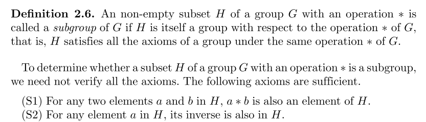

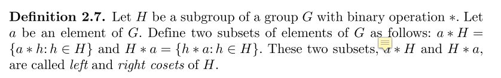

陪集的一些性质：

1. No two elements of a coset of H are identical. 
2. No two elements from two different cosets of H are identical. 
3. Every element of G appears in one and only one coset of H.
4. All distinct cosets of H are disjoint.
5. The union of all the distinct cosets of H forms the group G.

拉格朗日定理：

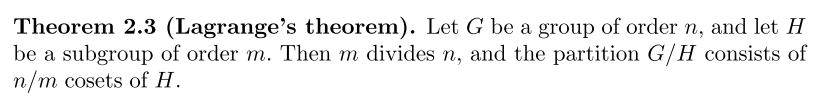

## 2.3 域

有限域在编码理论中非常重要。

### 2.3.1 定义和基本概念

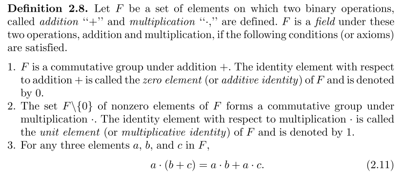

从定义在可以看到，域可以分为两个群，每个群各有一个单位元素，因此域的元素个数至少为2，且可以证明：存在只含有两个元素的域。

A field is simply an algebraic system in which we can perform addition, sub- traction, multiplication, and division without leaving the field.

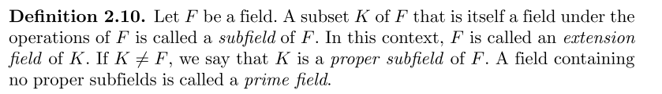

从下面这个定义也可以引入到有限域：

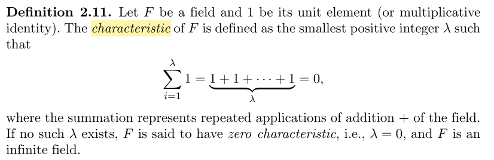

一条证明，解释了师姐讲文章时的疑问：

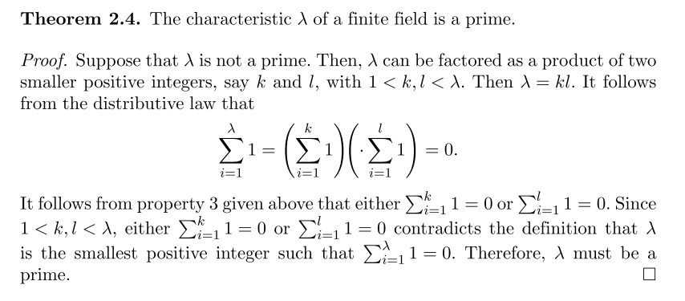

### 2.3.2 Finite Fields

有限域又叫伽罗华域，在差错控制编码中非常重要。记作 GF(p)，p 为素数。

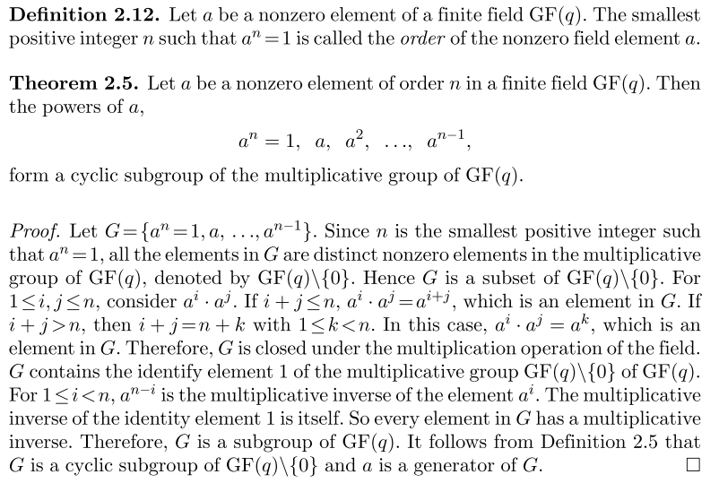

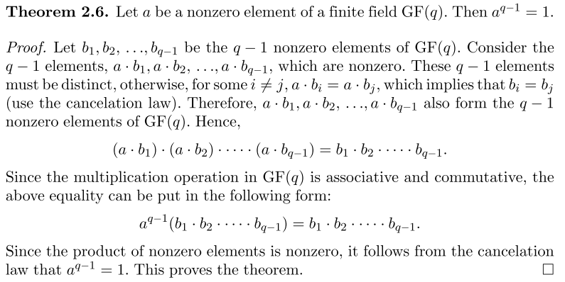

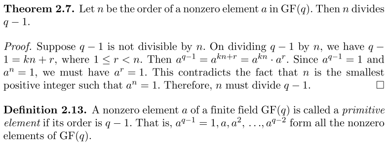

## 2.4 Vector Space

### 2.4.1 Basic Definitions and Properties

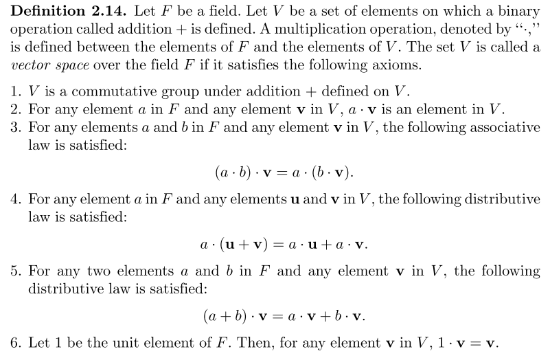

## 2.5 Polynomials over Finite Fields

## 2.6 Construction and Properties of Galois Fields

构造方法：通过 GF(p) 的 m 阶 primitive polynomials 得到 root a，那么，{0, 1, a, a^2, ..., a^(p^m-2)} 构成了 GF(p^m)。

### 2.6.2 Some Fundamental Properties of Finite Fields

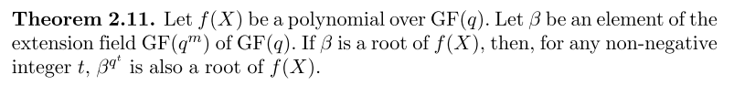

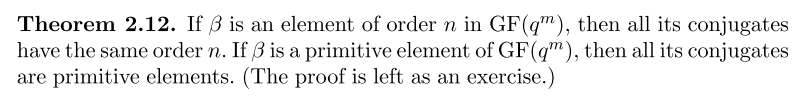

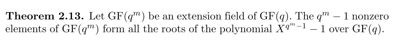

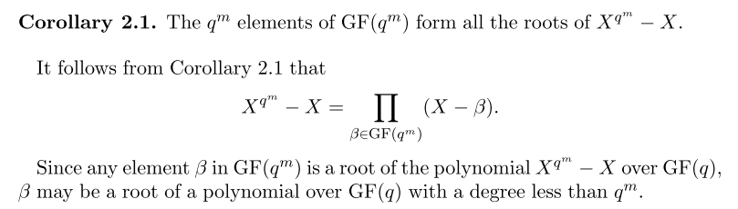

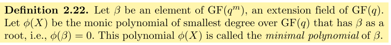

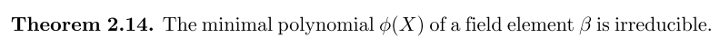

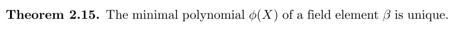

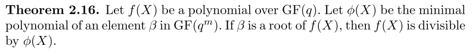

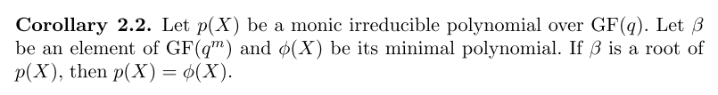

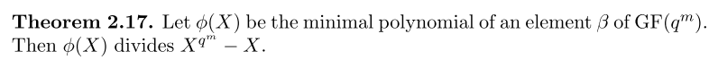

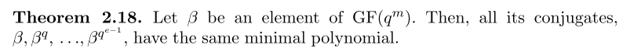

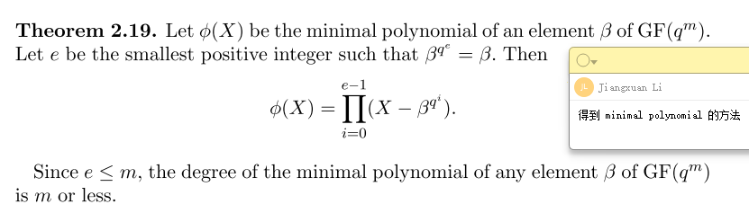

## 2.7 Finite Geometries

