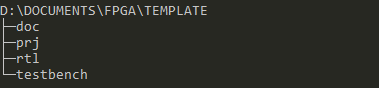
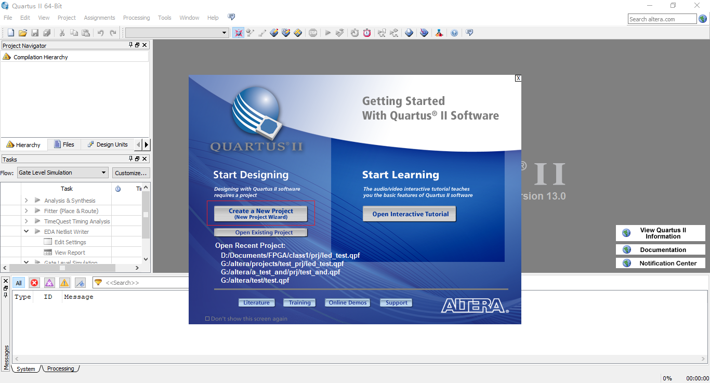
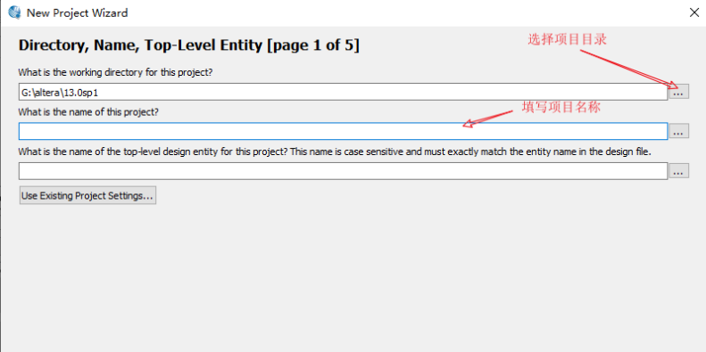
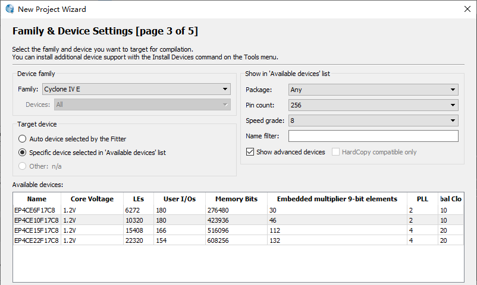
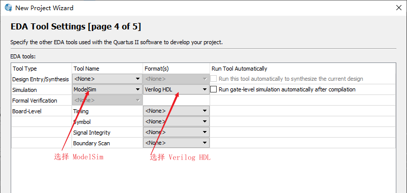
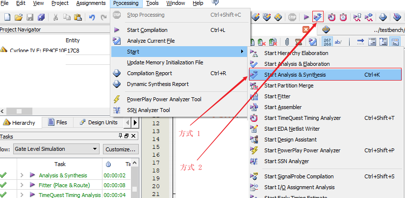
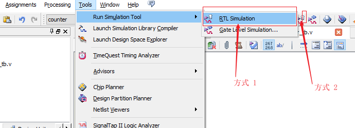
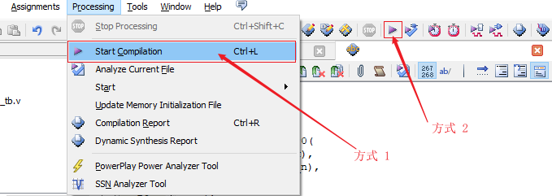
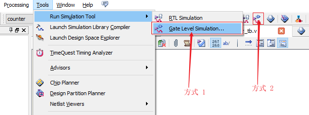

几天前再次从老师那儿得知毕设我需要做的是 LDPC 码的 FPGA 实现，看起来我必须得找时间学学 FPGA 了。本文就是在今天看完 B 站[小梅哥](https://space.bilibili.com/476579378)的[FPGA视频](https://www.bilibili.com/video/BV1KE411h7AZ)做的笔记，简单介绍 FPGA 的开发流程，最后会在 Quartus 中创建一个工程。

<!-- more -->

## 1. 开发流程

一般的 FPGA 项目开发会遵循下面这个流程，从设计输入到最后的在线调试，当然有的人叫法可能不同，我看到的这个教程是这么介绍的，下面逐个来看每一步都需要做什么。

### 1.1 设计定义

### 1.2 设计输入

### 1.3 分析和综合

### 1.4 功能仿真

### 1.5 布局布线

### 1.6 时序仿真

### 1.7 IO 分配以及文件的生成

### 1.8 配置 FPGA

### 1.9 在线调试

##  2. 如何完成一个简单的项目

了解了上面的开发流程后，现在以一个简单的例子说明具体是如何操作的，同时学习下如何在 Quartus 中创建工程。

+ **设计定义**

  一个二选一多路器，包含两个输入 IO，a 和 b，可以是高或低电平，还有一个输入按键，当按键按下时，LED 与 a 端口状态相同，当按键松开时，LED 与 b 端口状态相同。

这就完成了第一步，我们明确了需要做的东西需要实现的功能是什么样的。接下来是第二步，我们需要在 Verilog 文件中定义模块，将我们的设计实现出来。

### 2.1 创建工程

在创建工程之前，先了解下我们的项目目录安排，如下图所示，template 文件夹下包含了四个文件夹，功能分别是：

+ doc 用来存放相关的文档；
+ prj 用来存放项目相关的文件；
+ rtl 用来存放我们设计模块，保存的是 Verilog 文件；
+ testbench 存放的是 testbench 的 Verilog 文件，在涉及到时在详细述。



了解项目目录安排后，我们就可以创建工程了，每次需要创建工程时，可以把这个 template 拷贝一份然后改为我们需要的名字即可。打开 Quartus 软件，开始界面如下所示，我使用的是 13.0 版本。



点击红框处的 Create a New Project 就可以开始创建一个新工程了，点击下一步会出现如下界面，在这个界面有两件事需要做：选择项目目录，填写项目名称。



像我们刚才所说的一样，复制 template 目录，重命名为 test，然后选择项目目录为 test 下的 prj 目录，填写项目名称为也为 test，然后点击下一步，这个界面我们可以添加已经有的文件，但我们还没有，直接点击下一步，在这里我们需要选择 FPGA 的型号，这里根据手中的板子上的 FPGA 型号选择即可，关于 FPGA 的命名规则，可以上网搜下。



选择完之后点击下一步，在这里我们需要选择 EDA 工具，这里选择 Simulation 工具即可，我这里安装了 ModelSim，所以选择 ModelSim，一般还是建议使用 ModelSim-Altera，说是用 ModelSim 会有一些路径问题，需要配置，对初学者不是很友好，我暂时还没有碰到，因此先这么用着。然后选择 Format 为 Verilog HDL。



之后一路点击next即可。我们的项目创建完毕了。

### 2.2 编写模块

接下来编写模块以实现设计定义，先创建 Verilog 脚本：Ctrl + N 新建文件，选择 Verilog HDL。新建文件后，将文件保存到 rtl 目录下，命名为 test.v，之后就可以编写 module 了。在打开的 test.v 文件中输入如下内容：

```verilog
module test(a, b, key_in, led_out);
	
	input a; // 输入端口 a
	input b; // 输入端口 b
	
	input key_in; // 按键输入 选择信号
	
	output led_out; // led 控制端口
	
	// 当 key_in == 0, led_out = a
	
	assign led_out = (key_in == 0) ? a : b;
	
endmodule 
```

### 2.3 分析与综合

这个模块就可以实现我们设计定义中的内容，编写完之后，点击菜单栏中的 Processing 下的 Start 下的 Start Analysis & Synthesis，或者点击工具栏上的 Start Analysis & Synthesis，对文件进行分析和综合，检查文件中是否有错，如果有的话，需要去解决才能进行下一步。



### 2.4 前仿真

前仿真前，先要配置我们的 testbench。完成之后可以点击 RTL Simulation 进行前仿真。



### 2.5 布局布线

点击 Start Compilation：



### 2.6 后仿真

点击 Gate Level Simulation：

