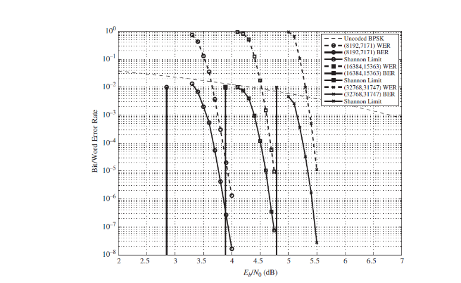
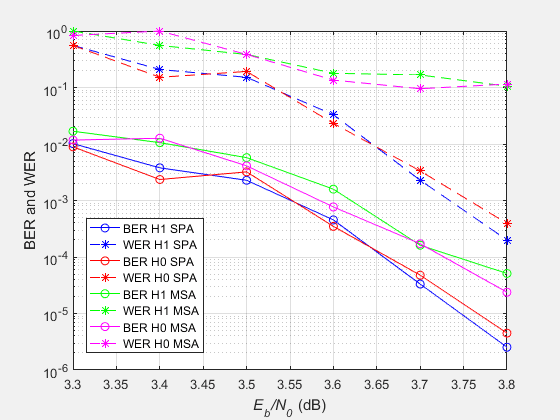

过去的这两周，我的时间基本花在了 LDPC 码的学习上，开始是阅读『hannel Codes』这本书，然后就是用 C 语言实现其中介绍的译码算法和 SPA 和其简化版本 MSA，若是不深入其原理，实现这个算法并不困难，但我忽视了一个重要的问题：我实现的算法最终要达到什么样的效果？这导致我白白浪费了两天时间。

<!-- more -->
书上给出的 BER 曲线中，使用的算法是 SPA，而我实现的算法是 MSA，其他条件相同的情况下，MSA 性能就是不如 SPA，因为它只是 SPA 的简化版本。我做出来的误码率曲线老是和书上的差一点，让我非常困惑，纠结了半天，后面问了老师，她给了她当时做的时候生成的 H 矩阵和当时实现的代码，让我作一个参考，这对我帮助很大。

昨天一天还是白白度过了，我在极度自闭中混过了一天，期间断点运行了代码试了试，发现了我原来实现算法中的一个小问题，还优化了一下代码，但都对性能毫无改进，就算是使用老师给的 H 矩阵也是一样。我开始怀疑是算法本身的问题，是不是它根本就达不到书上给出的性能，于是今天我回头去看书，在图的上方，作者写明了仿真算法是 SPA，而我做的是 MSA！该死，我居然直接忽视了这么明显了信息。在往前翻翻，作者提到 MSA 会比 SPA 的性能差 0.1dB，我的仿真是符合的！我有点激动，赶紧实现了 SPA，稍加调试，开始运行，等待结果。

**果然，就是 MSA 算法的问题，书上给出的图在 SPA 算法下的，而我做的是 MSA，自然有性能差距。**

这次仿真就告一段落了，后续我会写几篇文章，总结仿真实现的过程以及在仿真中遇到的问题。现在我觉得最关键的一个问题是：**面对仿真结果的不理想，如何进行调试，尤其是时间有限的情况下，如何快速定位错误。**这是个共性的问题，需要经验的积累，从这次经历中我能学到的是什么呢？找时间总结下。

