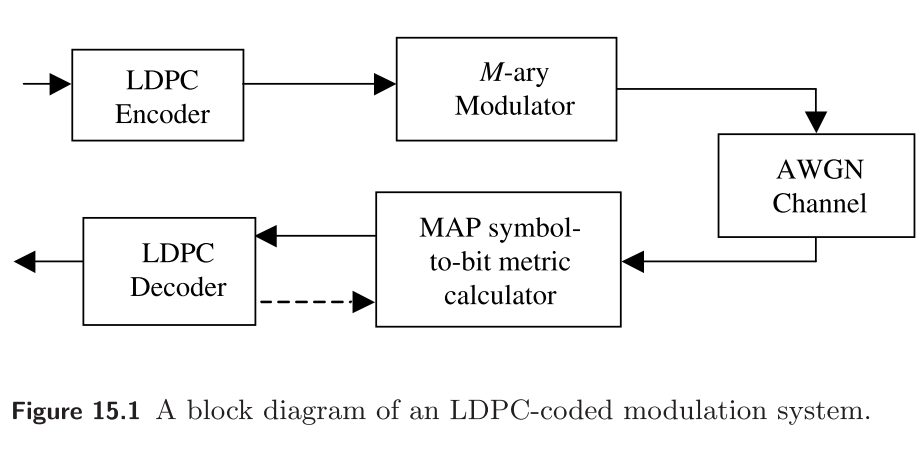
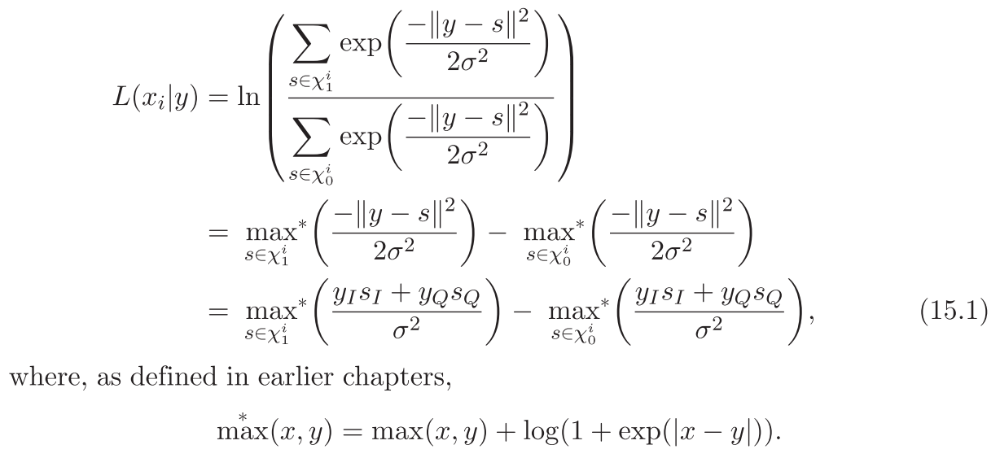

实验室的第二天，写下的第一篇日志。今天的任务是实现 LDPC 码的高阶调制问题，经过了一番折腾，最终得到了一个看起来正确的方法，这种方法也在『Channel Codes』这本书的第 15 章简单提到了。实现 LDPC 码的高阶调制解调框图如下所示。

<!-- more -->

问题在于如何从接收到的符号中获得 LDPC 码译码器需要的信息，15 章中给出了在 SPA 下，由接收到的符号求每个比特的内信息计算方法，如下所示：

其他的计算则和 BPSK 调制的 LDPC 码译码相同，由此我们解决了 LDPC 码的高阶调制问题。当然肯定有很多细节我没有考虑到，暂时先这样吧，后面想到了再补充。