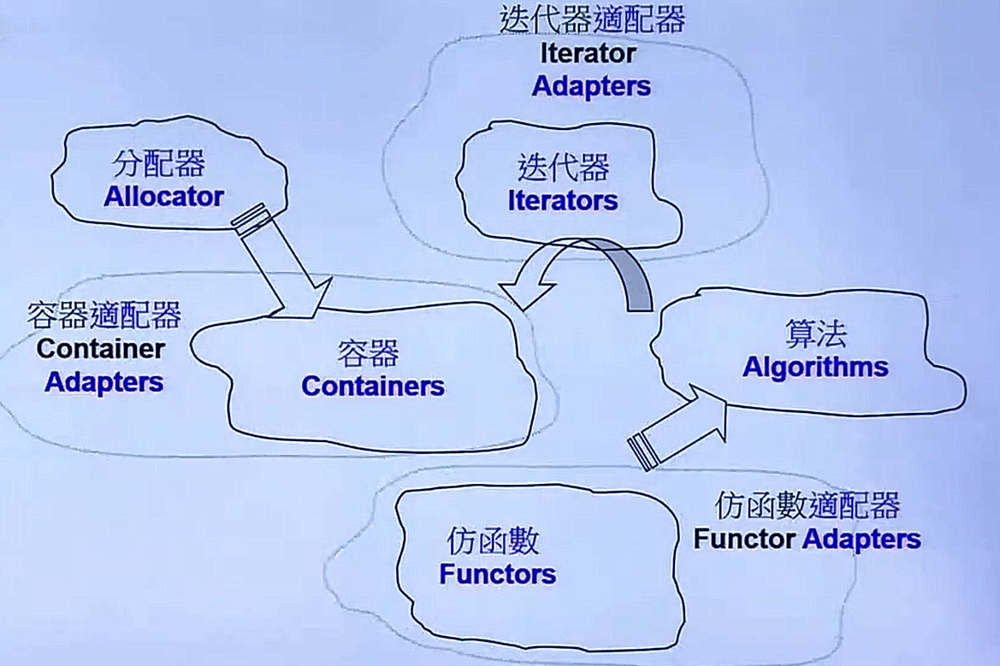
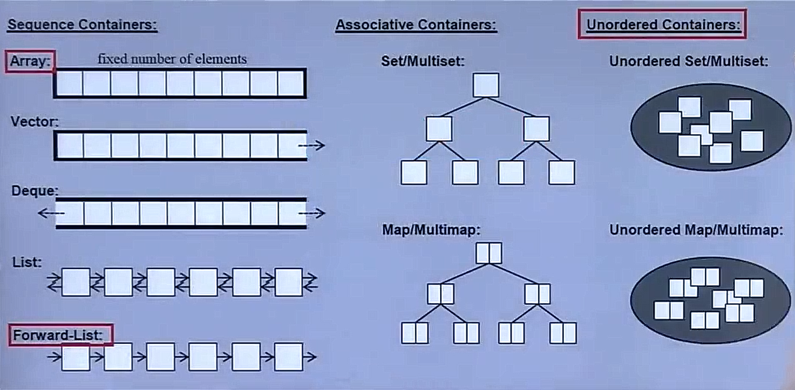

STL 六大部件：
+ 容器（Containers）
+ 分配器（Allocators）
+ 算法（Algorithms）
+ 迭代器（Iterators）
+ 适配器（Adapters）
+ 仿函数（Functors）



一个例子：

```c++
#include <vector>
#include <algorithm>
#include <functional>
#include <iostream>
using namespace std;
int main()
{
    int ia[6] = {27, 210, 12, 47, 109, 83};
    vector<int, allocator<int>> vi(ia, ia+6);
    
    cout << count_if(vi.begin(), vi.end(),
            not1(bind2nd(less<int>(), 40)));
    return 0;
}
```

前闭后开区间：begin 指向第一个元素，end 指向最后一个元素的下一个位置。

遍历容器：
```c++
    Container<T> c;
    
    Container<T>::iterator ite = c.begin();
    for (; ite != c.end(); ++ite) {}
```

C++11带来的新方法：

```c++
//    for ( decl : coll ) {
//        statement;
//    }
    for ( int i : { 2, 3 ,5, 7} ) {
        std::cout << i << std::endl;
    }
    
    std::vector<double> vec;
    for ( auto elem : vec ) {
        std::cout << elem << std::endl;
    }
    
    for ( auto &elem : vec ) {
        elem *= 3;
    }
```

## 容器——结构与分类



序列型容器（Sequence Containers）：
+ Array（C++11）
+ Vector
+ Deque
+ List
+ Forward-List

关联型容器（Associative Containers）：几乎所有编译器支持的底层实现都是红黑树
+ Set/Multiset
+ Map/Multimap

无序容器（Unordered Containers）从C++11开始：底层实现是HashTable：Separate Chaining
+ Unordered Set/Multiset
+ Unordered Map/Multimap

