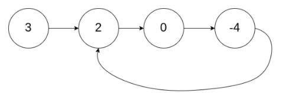
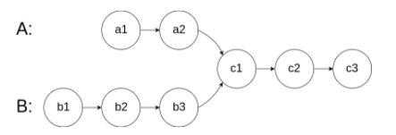
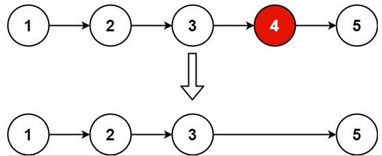

这几天忙着整理实验数据，耽搁了。数组部分已经写完了，加起来一共 10 道题吧，不算太难，接下来是链表部分，这是第一篇，包括 4 道题：[Linked List Cycle](https://leetcode.com/problems/linked-list-cycle/)，[Linked List Cycle II](https://leetcode.com/problems/linked-list-cycle-ii/)，[Intersection of Two Linked Lists](https://leetcode.com/problems/intersection-of-two-linked-lists/)，[Remove Nth Node From End of List](https://leetcode.com/problems/remove-nth-node-from-end-of-list/)。另外，我决定用 C++ 来写后面的题，C 还是太原始了。

前两题挺有意思的，去年也写过，还记得当时写得非常痛苦，后来直接放弃了刷题计划……现在看来也不过如此，现在面临的任何问题几乎都有对应的解决方法，当时我太过自卑自傲，不愿去查找，现在好了，抱着学习的心态，想不出来就去查，学会别人的方法就好。应用双指针技术可以很好地解决这两个问题，第二题的解法叫 Floyd 算法，还挺有名的，自己画画图、设几个未知数就能把问题解决了。

<!--more-->

## Linked List Cycle

> Given `head`, the head of a linked list, determine if the linked list has a cycle in it. There is a cycle in a linked list if there is some node in the list that can be reached again by continuously following the `next` pointer. Internally, `pos` is used to denote the index of the node that tail's `next` pointer is connected to. **Note that `pos` is not passed as a parameter**. Return `true` *if there is a cycle in the linked list*. Otherwise, return `false`.

### *example*:

```
Input: head = [3,2,0,-4], pos = 1
Output: true
Explanation: There is a cycle in the linked list, where the tail connects to the 1st node (0-indexed).
```

### solution:

 ```c++
bool hasCycle(ListNode *head) {
    ListNode *slow_p = head;
    ListNode *fast_p = head;
    bool isCircle = false;
    while ( fast_p && fast_p-next ) {
        slow_p = slow_p-next;
        fast_p = fast_p-next-next;
        if ( slow_p == fast_p ) {
            isCircle = true;
            break;
        }
    }
    return isCircle;
}
 ```

 ## Linked List Cycle II

> Given a linked list, return the node where the cycle begins. If there is no cycle, return null. There is a cycle in a linked list if there is some node in the list that can be reached again by continuously following the next pointer. Internally, pos is used to denote the index of the node that tail's next pointer is connected to. Note that pos is not passed as a parameter. Notice that you should not modify the linked list.

 ### example:



 ```
 Input: head = [3,2,0,-4], pos = 1
 Output: tail connects to node index 1
 Explanation: There is a cycle in the linked list, where tail connects to the second node.
 ```

 ### solution:

 ```c++
ListNode *detectCycle(ListNode *head) {
    ListNode *slow_p = head;
    ListNode *fast_p = head;
    bool hasCircle = false;
    while ( fast_p && fast_p-next ) { // detect circle
        slow_p = slow_p-next;
        fast_p = fast_p-next-next;
        if ( slow_p == fast_p ) {
            hasCircle = true;
            break;
        }
    }
    if ( hasCircle ) { // find circle start
        fast_p = head;
        while ( fast_p != slow_p ) {
            fast_p = fast_p-next;
            slow_p = slow_p-next;
        }
        return slow_p;
    } else
        return nullptr;
}
 ```

 ## Intersection of Two Linked Lists

> Write a program to find the node at which the intersection of two singly linked lists begins.

 ### example:

 For example, the following two linked lists begin to intersect at node c1.



 ### solution:

 ```c++
ListNode *getIntersectionNode(ListNode *headA, ListNode *headB) {
    // traverse two lists, get lengths of lists, minus them,
    if ( headA == headB ) return headA;
    ListNode *pA = headA;
    ListNode *pB = headB;
    ListNode *pp = nullptr;
    int lenDiff = 0;
    while ( pA && pB ) {
        pA = pA-next;
        pB = pB-next;
    }

    if ( pB ) { // listB is longer
        pp = headB;
        pA = headA;
        while ( pB ) {
            pp = pp-next;
            pB = pB-next;
        }
        while ( pp && pA ) {
            if ( pp == pA )
                return pp;
            pp = pp-next;
            pA = pA-next;
        }
    }
    if ( pA ) { // listA is longer
        pp = headA;
        pB = headB;
        while ( pA ) {
            pp = pp-next;
            pA = pA-next;
        }
        while ( pp && pB ) {
            if ( pp == pB )
                return pp;
            pp = pp-next;
            pB = pB-next;
        }
    }
    // length equally
    pA = headA;
    pB = headB;
    while ( pA && pB ) {
        if ( pA == pB )
            return pA;
        pA = pA-next;
        pB = pB-next;
    }
    return nullptr;
}
 ```

## Remove Nth Node From End of List

Given the `head` of a linked list, remove the `nth` node from the end of the list and return its head. **Follow up:** Could you do this in one pass?

### example:



```
Input: head = [1,2,3,4,5], n = 2
Output: [1,2,3,5]
```

### solution:

```c++
ListNode* removeNthFromEnd(ListNode* head, int n) {
    // it's a esay problem
    ListNode *p1 = head;
    ListNode *p2 = head;
    ListNode *toDel;
    // according to constrains
    for ( int i = 0; i < n; i++)
        p1 = p1->next;
    while ( p1 && p1->next ) {
        p1 = p1->next;
        p2 = p2->next;
    }
    if ( p1 ) {
        toDel = p2->next;
        p2->next = p2->next->next;
    } else {
        toDel = head;
        head = head->next;
    }
    delete toDel;
    return head;
}
```
## Summary: Two-pointer in Linked List

下面给出一个链表中双指针技巧的使用模板（来自leetcode）。

```c++
// Initialize slow & fast pointers
ListNode* slow = head;
ListNode* fast = head;
/**
 * Change this condition to fit specific problem.
 * Attention: remember to avoid null-pointer error
 **/
while (slow && fast && fast->next) {
    slow = slow->next;          // move slow pointer one step each time
    fast = fast->next->next;    // move fast pointer two steps each time
    if (slow == fast) {         // change this condition to fit specific problem
        return true;
    }
}
return false;   // change return value to fit specific problem
```

这就是全部的双指针技巧部分了，这几道题都不算难，解题思路也很直观，不多做分析了。