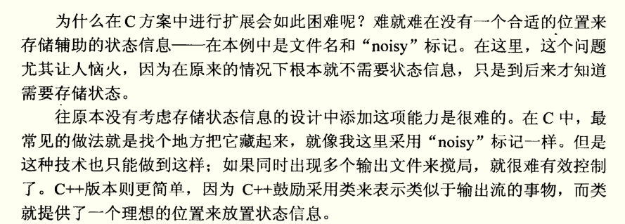
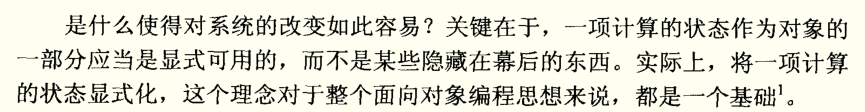
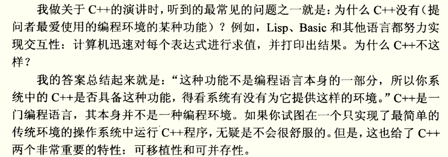

> 将一项计算的状态显示化，这个理念对于整个面向对象编程思想来说，都是一个基础。

通过把有关系的事物联系起来，我们就能更加清晰地用C++来表达自己的意图。

本书的两个思想核心：**实用和抽象**。

C++ 是一门实用的编程语言，几乎所有的系统都支持C/C++，C++没有对复杂操作系统的依赖性，如不需要垃圾收集机制或者交互执行等功能的支持。

### 类设计者的检查表

+ 你的类需要一个构造函数吗？
+ 你的数据成员是私有的吗？
+ 你需要一个无参的构造函数吗？
+ 是不是每个构造函数初始化所有的数据成员？
+ 你的类需要析构函数吗？
+ 你的类需要复制构造函数吗？
+ 你的类需要一个赋值操作符吗？
+ 你的赋值操作符能正确地将对象赋给对象本身吗？
+ 你的类需要定义关系操作符吗？
+ 删除数组你记住用 `delete[]` 吗？
+ 记得在复制构造函数和赋值操作符的参数类型中加上 const 了吗？
+ 如果函数有引用参数，它们应该是 const 引用吗？
+ 记得适当地声明成员函数为 const 的了吗？

