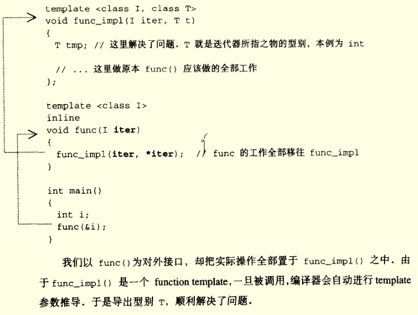
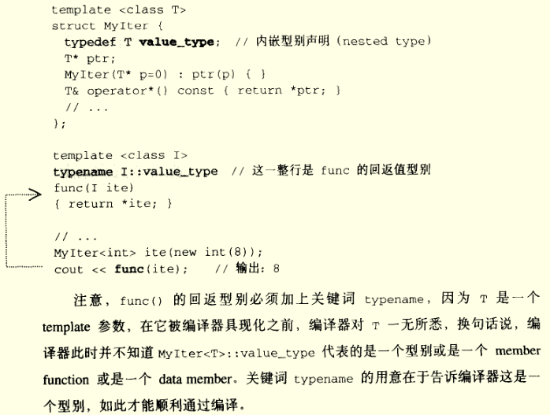
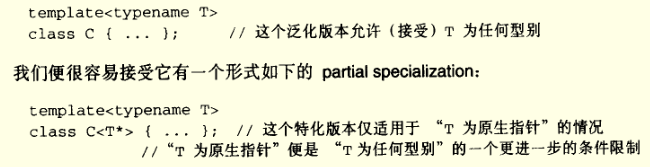
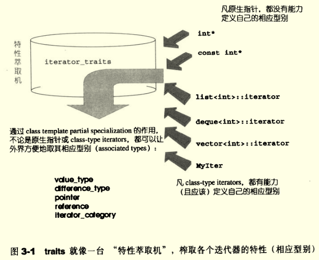
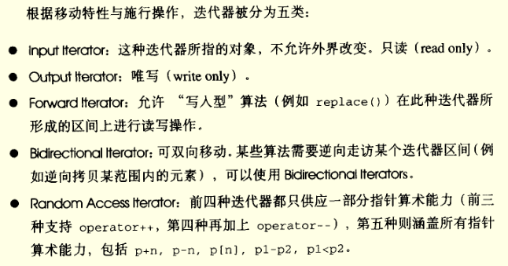
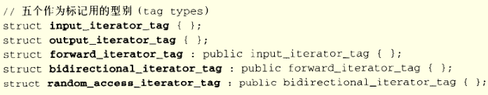

本篇是阅读《STL源码剖析》第3章后作的笔记，本不想写的，嫌太麻烦，思来想去，为了提高学习的效果，也是为了给自己找点事做，还是认真写完这篇笔记。

阅读时随手截图以及一些理解放在notion中了，链接在此[iterator笔记](https://www.notion.so/lijiangxuan/3-traits-aeaa810b59c74001800a098508f00dec)，其实里面不过是几张截图，没写多少文字，又多了一篇水的笔记。

---

<!-- more -->

《Design Pattern》中提到的Iterator模式定义如下：

> 提供一种方法，使之能够依序访问某个聚合物（容器）所含的各个元素，而又无需暴露该聚合物的内部表述方式。

这个定义需要关注的有两个：依序访问以及不暴露内部表述方式。这两个要求对迭代器的设计有很大的影响。

第 1 节强调了迭代器是STL的关键所在。因为有了迭代器，**STL能够将数据容器（containers）和算法（algorithms）分开，彼此独立设计，而迭代器扮演了两者的胶合剂。**对于容器和算法的泛化，class templates 和 function templates 可分别完成目标，但是两者胶合剂——迭代器的设计却需要花一番心思。

第 2 节开始引入迭代器。从 smart pointer 的角度理解迭代器，实际上在使用迭代器时，把它当作 pointer 就好。因此，迭代器最重要的工作就是像指针一样工作，因此需要完成 `operator*` 和 `operator->` 的重载，以通过迭代器完成dereference和member access 的工作。

接着举了一个设计 `list` 迭代器的例子，包括三个模板类：List，ListItem 和 ListIter。这样一来，迭代器确实可以设计起来，而且声明一个迭代器可以如下方式：`ListIter<ListItem<int>> begin()`。这个时候问题出现了，如果在一个算法中，需要用到 `*iter != value` 类似的操作，那么就要为 `ListItem` 定义全局的 `operator!=` 函数了，这暴露了类的具体实现。

最终的结论是，这种暴露无法避免，因此 List 的设计者也需要完成迭代器的开发工作，因此，**每一种 STL 容器都提供有专属迭代器的**。

第3节介绍了迭代器的相应型别（associated types）。我不太认可这里的中文翻译，当然 jjhou 可能也是如此，因此加上来英文原名——associated types。迭代器的 associate type 可以理解成迭代器所指之物的类型。考虑这个问题是有实际意义的，如果算法中必须声明一个变量，且变量类型是**迭代器所指向对象的型别**，解决办法是：利用 function template 的参数推导（argument deducation）机制。



这里还需要说明的时，迭代器相应型别（associated types）不只是『迭代器所指对象的型别』而已，实际上有 5 种，后面会详细提到。

第 4 节介绍了 Traits 编程技巧。终于到了正题 了，jjhou 把 Traits 称作 STL 源代码门匙，其对于 STL 的重要性不言而喻。

上述的参数推导虽好，但是如果需要进行返回值的推导，我们就需要新的方法了。声明**内嵌型别**（nested type）似乎是个好主意。像下面这样：



看起来不错，但是有一个陷阱：**并不是所有的迭代器都是 class type**。比如原生指针，无法为它定义内嵌型别。为了处理这个问题，我们需要模板偏特化（template partial specialization）：

>  如果 class template 拥有一个以上的 template 参数，我们可以针对其中某些 template 参数进行特化工作，即在泛化设计中提供一个特化版本。



现在，我们可以解决原生指针带来的问题了，为迭代器的template参数为指针的情况，设计特化版的迭代器。

如下就是整个设计的关键，traits，专门**用来萃取迭代器的特性**。

```cpp
template <class T>
struct iterator_traits {
    typedef typename I::value_type value_type;
}
```

而对于迭代器是原生指针的情况，可以设计偏特化版本：

```cpp
template <class T>
struct iterator_traits<T*> {
    typedef T value_type;
}
```

那么在设计函数时可以这样写：

```cpp
template <class I>
typename iterator_traits<I>::value_type
func(I ite) { return *ite; }
```

对于原生指针的 I 可以调用偏特化的版本，这正是我们想要的，实在是太酷了！

为了应对 const 指针，还需要另外一个偏特化版本：

```cpp
template <class T>
struct iterator_traits<const T*> {
    typedef T value_type;
}
```

这样对迭代器相应型别中的推导就完成了，实际上 STL 也是如此设计的，iterator_traits 包括两个偏特化版本。



接着依次介绍了 value_type，difference_type，reference_type，pointer_type 和 iterator_category。

最复杂的是最后一个 iterator_category 的设计，也许要明天再写了。

迭代器的分类如下：



当然，其实我们不用过多关注category，只要明白设计这么多种类是贴合实际的，是为了提高某些代码运行时的效率，但是这样一来就需要对不同类型的迭代器分别设计函数，这显然不够泛化，因此进行了一系列的设计，以期望对函数进行重载。这又用到 traits，我们期望 traits 能够萃取出迭代器的种类！这个类别必须是class type，因为编译器需要依赖它进行重载决议（overloaded resolution）。



大概重要的内容就是这些，关键是 traits 的想法，实在是巧妙，但其实也是没有办法的事情，因为 C++ 没有类型推导如 typeof 这样的函数，只能通过这种方法来完成了。

