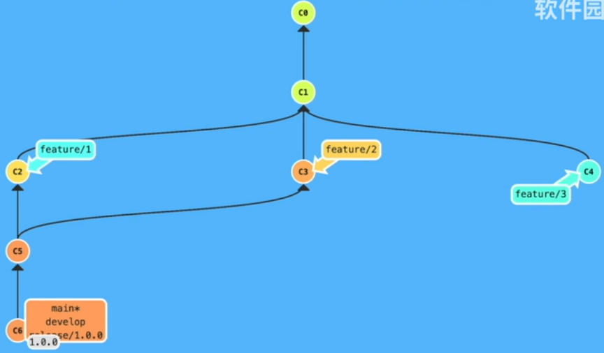
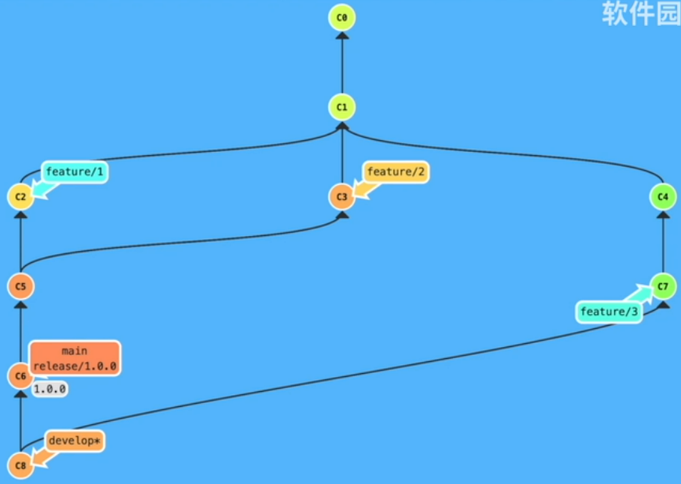
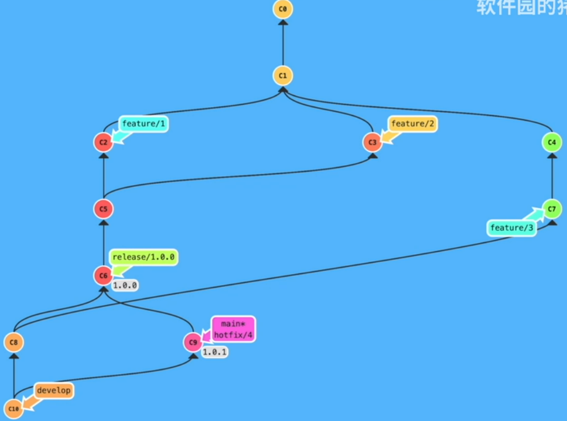
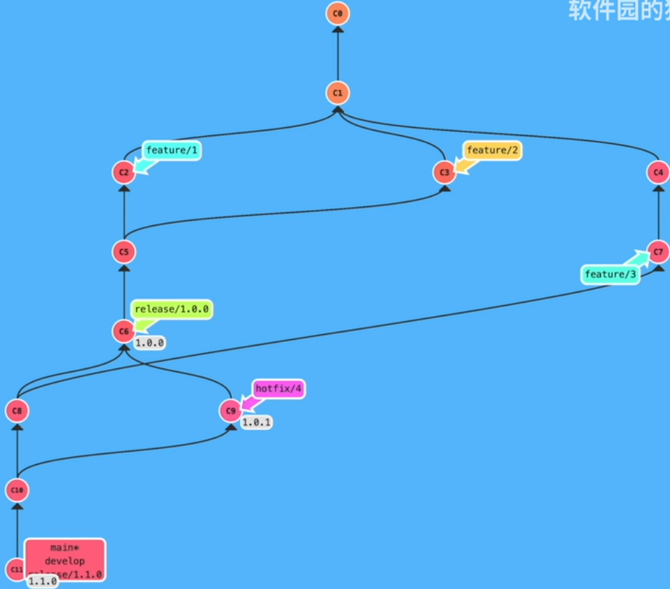

关于 git-flow 的简单介绍，是时候来好好管理我们的项目了，一条 main 交到底的方式并不合适。

参考：

[git-flow介绍及开发过程演示](https://www.bilibili.com/video/BV1W3411C72K?share_source=copy_web&vd_source=9f384d4584d09b2753c054baff8d4c9e)

基本的分支类型

| 分支名称    | 说明       | 命名             |
|:------- |:-------- |:-------------- |
| master  | 发布分支     | master 或者 main |
| develop | 开发分支     | develop        |
| feature | 功能分支     | feature/FOO-1  |
| bugfix  | 修复分支     | bugfix/FOO-2   |
| hotfix  | 紧急修复分支   | hotfix/FOO-3   |
| release | 发布前的准备工作 | release/1.0.3  |

额外的老版本的维护分支，一般使用 `support`，`support/1.0.x`。

<!-- more -->

---

在 learngitbranching 上做下面这些测试

## 合并两个 feature 上的提交

```shell
git branch develop
git checkout develop

git branch feature/1
git branch feature/2
git branch feature/3

git checkout feature/1
# do something
git commit -m "cm"

git checkout feature/2
# do something
git commit -m "cm"

git checkout feature/3
# do something
git commit -m "cm"

# 合并 feature/1 和 feature/2
git checkout develop
git merge feature/1
git merge feature/2

# 基于 develop 进行一个发布
git branch release/1.0.0
git checkout release/1.0.0

# 在 release 做一些发布的准备工作
# do something
git commit -m "to release"

# 切换到 develop 把 release 上做的修改合并到 release 上
git checkout develop
git merge release/1.0.0

# 一定要从从 release 上进行发布
# 而不是从 develop 上发布
git checkout main
git merge release/1.0.0

# 发布之后在 main 上做一个 tag
git tag 1.0.0
```



---

## 合并第 3 个 feature 上的提交

```shell
git checkout feature/3
git commit -m "cm"

# 合并到 develop
git checkout develop
git merge feature/3

# do more things
```



---

## 在 1.0.0 进行一个紧急修复

```shell
git checkout 1.0.0
git branch hotfix/4
git checkout hotfix/4

# do something
git commit -m "fix"

# 从 hotfix 上合并到 develop 和 main 并进行发布
git checkout develop develop
git merge hotfix/4

# 合并到 main 并发布
git checkout main
git merge hotfix/4

# 发布
git tag 1.0.1
```



---

## 在 develop 上发布新版本 1.1.0

```shell
git checkout develop
git branch release/1.1.0

git checkout release/1.1.0
# do something
git commit -m "cm"

# 合并到 develop
git checkout develop
git merge release/1.1.0

# 合并到 main
git checkout main
git merge release/1.1.0

# 发布
git tag 1.1.0
```

---

## 最终的效果


