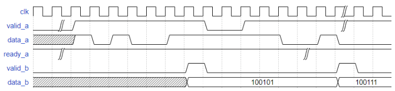

数据串并转换的练习。这里做了许多简化，不用考虑阻塞的情况：即上游使用 valid-ready，下游使用 valid-only 的握手机制，因此不会出现阻塞。如果上下游均使用 valid-ready 握手机制，那么需要处理阻塞的情况，这个问题会在后续有所考虑。

[原题链接：VL30 数据串并转换电路](https://www.nowcoder.com/practice/6134dc3c8d0741d08eb522542913583d?tpId=302&tqId=5000602&ru=/exam/oj&qru=/ta/verilog-advanced/question-ranking&sourceUrl=%2Fexam%2Foj%3Ftab%3DVerilog%25E7%25AF%2587%26topicId%3D302)



<!-- more -->

---

## code

```verilog
`timescale 1ns/1ns

module s_to_p(
    input                 clk         ,
    input                 rst_n        ,
    input                valid_a        ,
    input                 data_a        ,

     output    reg         ready_a        ,
     output    reg            valid_b        ,
    output  reg [5:0]     data_b
);
    // 握手机制
    // valid-ready   <---> valid-only
    // 两者之间的对比如何

    wire valid_in;
    wire valid_out;

    assign valid_in = ready_a && valid_a; 

    reg [5:0] buffer;
    reg [2:0] cnt;
    wire cntdone = cnt == 3'd5;

    // a counter
    always @(posedge clk or negedge rst_n) begin
        if (rst_n == 1'b0) cnt <= 0;
        else if (valid_in && cntdone) cnt <= 0;
        else if (valid_in) cnt <= cnt + 1'b1;
        else cnt <= cnt;
    end

    // deal with buffer
    always @(posedge clk or negedge rst_n) begin
        if (rst_n == 1'b0) buffer <= 0;
        else if (valid_in) buffer <= {data_a, buffer[5:1]};
    end

    // deal with output
    always @(posedge clk or negedge rst_n ) begin
        if (rst_n == 1'b0) ready_a <= 0;
        else ready_a <= 1'b1;
    end

    always @(posedge clk or negedge rst_n) begin
        if (rst_n == 1'b0) data_b <= 0;
        else if (valid_in && cntdone) data_b <= {data_a, buffer[5:1]};
        else data_b <= data_b;
    end

    always @(posedge clk or negedge rst_n) begin
        if (rst_n == 1'b0) valid_b <= 0;
        else if (valid_in && cntdone) valid_b <= 1'b1;
        else valid_b <= 0;
    end
endmodule
```
