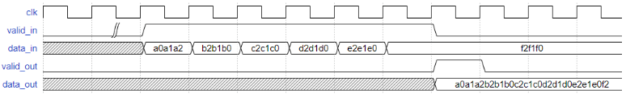

非整数倍的数据位宽转换，和上一篇比较类似，但是由于转换宽度非整数倍，会产生更多的状态，但又不复杂到需要使用状态机来解决。

[原题链接：VL32 非整数倍数据位宽转换24to128](https://www.nowcoder.com/practice/6312169e30a645bba5d832c7313c64cc?tpId=302&tags=&title=&difficulty=0&judgeStatus=0&rp=0&sourceUrl=%2Fexam%2Foj%3Ftab%3DVerilog%25E7%25AF%2587%26topicId%3D302)



通常的做法是 **寻转转换前后位宽的最小公倍数**。用计数器记录状态，计数器的值和最小公倍数相关。在这个例子中，转换前宽度 `A = 24`，转换后宽度 `B = 128`，最小公倍数为 `24 * 16 = 128 * 3`，所以：

+ 一共有 16 个状态。
+ 计数器 应该最大计数到 `16 - 1 = 15`
+ 其中有 3 个状态需要输出 `data_out `，且标明 `valid_out`

<!-- more -->

---

## code

```verilog
`timescale 1ns/1ns
module width_24to128(
    input                 clk         ,   
    input                 rst_n        ,
    input                valid_in    ,
    input    [23:0]        data_in        ,

     output    reg            valid_out    ,
    output  reg [127:0]    data_out
);
    reg [3:0] cnt;
    // 这个 buffer 有办法减小吗？
    reg [119:0] buffer;

    always @(posedge clk or negedge rst_n) begin
        if (rst_n == 1'b0)
            cnt <= 0;
        else if (valid_in)
            cnt <= cnt + 1'b1;
    end

    always @(posedge clk or negedge rst_n) begin
        if (rst_n == 1'b0) begin
            buffer <= 0;
            data_out <= 0;
            valid_out <= 0;
        end
        else if (valid_in) begin
            if (cnt == 4'd5) begin
                data_out <= {buffer, data_in[23:16]};
                buffer <= {buffer[95:0], data_in};
                valid_out <= 1'b1;
            end
            else if (cnt == 4'd10) begin
                data_out <= {buffer[111:0], data_in[23:8]};
                buffer <= {buffer[95:0], data_in};
                valid_out <= 1'b1;
            end
            else if (cnt == 4'd15) begin
                data_out <= {buffer[103:0], data_in};
                buffer <= {buffer[95:0], data_in};
                valid_out <= 1'b1;
            end
            else begin
                buffer <= {buffer[95:0], data_in};
                valid_out <= 1'b0;
            end
        end
        else
            valid_out <= 1'b0;
    end

endmodule
```
