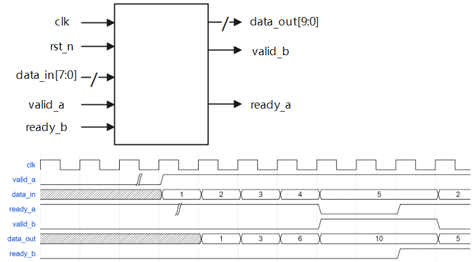

和上一篇类似，不过这次上下游握手协议均是 valid-ready。

[原题链接：数据累加输出](https://www.nowcoder.com/practice/956fa4fa03e4441d85262dc1ec46a3bd?tpId=302&tqId=5000601&ru=/exam/oj&qru=/ta/verilog-advanced/question-ranking&sourceUrl=%2Fexam%2Foj%3Ftab%3DVerilog%25E7%25AF%2587%26topicId%3D302)



数据通路的处理比较清晰，关键是上下游的控制信号传递。

这是核心：

```verilog
// valid_b == 1b'1 ---> 数据输出有效，此时停止读入新的数据
// ready_b == 1'b1 ---> 下游可以接收数据，此时可以读取新的数据
assign ready_a = ~valid_b || ready_b;
assign valid_in = ready_a && valid_a;
```

<!-- more -->

---

## code

```verilog
`timescale 1ns/1ns

module valid_ready(
    input                 clk         ,   
    input                 rst_n        ,
    input        [7:0]    data_in        ,
    input                valid_a        ,
    input                 ready_b        ,

     output                 ready_a        ,
     output    reg            valid_b        ,
    output  reg [9:0]     data_out
);

    wire valid_in;
    wire valid_out;

    // valid_b == 1b'1 ---> 数据输出有效，此时停止读入新的数据
    // ready_b == 1'b1 ---> 下游可以接收数据，此时可以读取新的数据
    assign ready_a = ~valid_b || ready_b;
    assign valid_in = ready_a && valid_a;

    reg [1:0] cnt;
    reg [9:0] buffer;

    wire cntdone = cnt == 2'd3;
    wire cntstart = cnt == 0;

    always @(posedge clk or negedge rst_n) begin
        if (rst_n == 1'b0) cnt <= 0;
        else if (valid_in && cntdone) cnt <= 0;
        else if (valid_in) cnt <= cnt + 1'b1;
        else cnt <= cnt;
    end

    always @(posedge clk or negedge rst_n) begin
        if (rst_n == 1'b0) buffer <= 0;
        else if (valid_in && cntdone) buffer <= 0; 
        else if (valid_in) buffer <= buffer + data_in;
    end

    always @(posedge clk or negedge rst_n) begin
        if (rst_n == 1'b0) data_out <= 0;
        else if (valid_in && cntstart) data_out <= data_in;
        else if (valid_in) data_out <= data_out + data_in;
        else data_out <= data_out;
    end

    always @(posedge clk or negedge rst_n) begin
        if (rst_n == 1'b0) valid_b <= 0;
        else if (valid_in && cntdone) valid_b <= 1'b1;
        else if (ready_b) valid_b <= 0;
        else valid_b <= valid_b;
    end

endmodule
```
