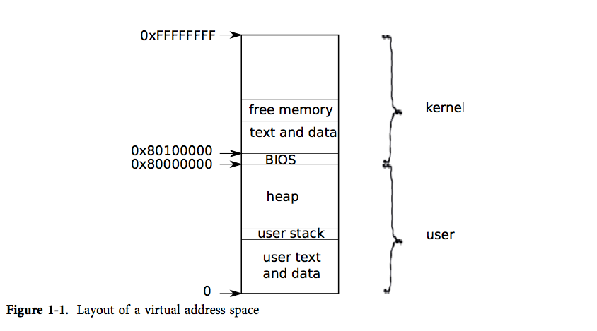

通过第一个进程的创建来解释 xv6 是如何开始运行的，让我们得以一窥 xv6 提供的各个抽象是如何实现和交互的。

## 进程

进程是一个抽象概念，它让一个程序可以假设它独占一台机器。进程向程序提供“看上去”私有的，其他进程无法读写的内存系统（或地址空间），以及一颗“看上去”仅执行该程序的CPU。

xv6 使用页表（pagetable，由硬件实现）来为每个进程提供其独有的地址空间。页表将*虚拟地址*（x86 指令所使用的地址）翻译（或说“映射”）为*物理地址*（处理器芯片向主存发送的地址）。

<!-- more -->



xv6 为每个进程维护了不同的页表，这样就能够合理地定义进程的地址空间了。

如图1-1所示，一片地址空间包含了从虚拟地址0开始的*用户内存*。它的地址最低处放置进程的指令，接下来则是全局变量，栈区，以及一个用户可按需拓展的“堆”区（malloc 用）。

xv6 将内核映射到了地址空间的高地址处，即从 0x80100000 开始。

> 这是很重要的内存模型，需要牢记。

xv6 使用结构体 `struct proc` 来维护一个进程的状态，其中最为重要的状态是进程的页表，内核栈，当前运行状态。

**每个进程都有一个运行线程（或简称为*线程*）来执行进程的指令。**线程可以被暂时挂起，稍后再恢复运行。系统在进程之间切换实际上就是挂起当前运行的线程，恢复另一个进程的线程。**线程的大多数状态（局部变量和函数调用的返回地址）都保存在线程的栈上。**

每个进程都有用户栈和内核栈（`p->kstack`）。当进程运行用户指令时，只有其用户栈被使用，其内核栈则是空的。

> 那么用户栈在哪儿呢？全部在上下文中，即 p->context。

要注意内核栈是用户代码无法使用的，这样即使一个进程破坏了自己的用户栈，内核也能保持运行。

**当进程使用系统调用时，处理器转入内核栈中，提升硬件的特权级，然后运行系统调用对应的内核代码。**当系统调用完成时，又从内核空间回到用户空间：降低硬件特权级，转入用户栈，恢复执行系统调用指令后面的那条用户指令。线程可以在内核中“阻塞”，等待 I/O, 在 I/O 结束后再恢复运行。

`p->pgdir` 以 x86 硬件要求的格式保存了进程的页表。xv6 让分页硬件在进程运行时使用 `p->pgdir`。进程的页表还记录了保存进程内存的物理页的地址。

### 源码

proc 的定义如下：

```c
struct proc {
	uint sz; // 进程内存大小(字节)
    pde_t* pgdir; 	// Page table 页表
    char *kstack; // 进程内核栈栈底
    enum procstate state; // 进程状态
    valatile int pid; // 
    struct proc *parent; // 父进程
    struct trapframe *tf;  // 当前 syscall 的 trap frame
    struct context *context; // swtch() here to run process
    void *chan;  // if non-zero, sleeping on chan
    int killed; // 非 0 则进程已被杀
    struct file *ofile[NOFILE]; // 打开的文件
    struct inode *cwd; // 当前目录
    char name[16]; // 进程名 (用于debugging)
};
```

进程状态定义如下：

```c
enum procstate {UNUSED, EMBRYO, SLEEPING, RUNNABLE, EUNNINF, ZOMBIE};
```

## 代码：第一个地址空间


当 PC 开机时，它会初始化自己然后从磁盘中载入 *boot loader* 到内存并运行。


