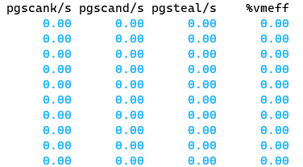
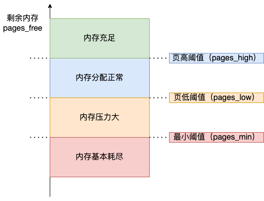

## 为什么要有虚拟内存？

- 第一，虚拟内存可以使得进程对运行内存超过物理内存大小，因为程序运行符合局部性原理，CPU 访问内存会有很明显的重复访问的倾向性，对于那些没有被经常使用到的内存，我们可以把它换出到物理内存之外，比如硬盘上的 swap 区域。
- 第二，由于每个进程都有自己的页表，所以每个进程的虚拟内存空间就是相互独立的。进程也没有办法访问其他进程的页表，所以这些页表是私有的，这就解决了多进程之间地址冲突的问题。
- 第三，页表里的页表项中除了物理地址之外，还有一些标记属性的比特，比如控制一个页的读写权限，标记该页是否存在等。在内存访问方面，操作系统提供了更好的安全性。

这就是虚拟内存的作用，为了引入虚拟内存，操作系统做了很多工作。

<!-- more -->

### 虚拟内存

**操作系统会提供一种机制，将不同进程的虚拟地址和不同内存的物理地址映射起来。**

### 内存分段

程序是由若干个逻辑分段组成的，如可由代码分段、数据分段、栈段、堆段组成。**不同的段是有不同的属性的，所以就用分段（\*Segmentation\*）的形式把这些段分离出来。**

> 这就进入到内存模型的范围。

但是分段会带来 **外部内存碎片** 的问题。

因此需要引入分页。

### 内存分页

页就是粒度更小的段，一般是 4KB。 

**分页是把整个虚拟和物理内存空间切成一段段固定尺寸的大小**。这样一个连续并且尺寸固定的内存空间，我们叫**页**（*Page*）。在 Linux 下，每一页的大小为 `4KB`。（12bit）

但是这样划分带来的问题是，页表太大，造成了很大的浪费，大概需要 4MB 大小的页表，这是无法接受的，因此引入了多级页表，32位机中引入了两级页表。

再次应用局部性，二级分页看起来占用了更多内存，但是由于局部性的存在，只有一小部分会被真正使用。

那么为什么不分级的页表就做不到这样节约内存呢？

我们从页表的性质来看，保存在内存中的页表承担的职责是将虚拟地址翻译成物理地址。假如虚拟地址在页表中找不到对应的页表项，计算机系统就不能工作了。所以**页表一定要覆盖全部虚拟地址空间，不分级的页表就需要有 100 多万个页表项来映射，而二级分页则只需要 1024 个页表项**（此时一级页表覆盖到了全部虚拟地址空间，二级页表在需要时创建）。

对于 64 位的系统，两级分页肯定不够了，就变成了四级目录，分别是：

- 全局页目录项 PGD（*Page Global Directory*）；
- 上层页目录项 PUD（*Page Upper Directory*）；
- 中间页目录项 PMD（*Page Middle Directory*）；
- 页表项 PTE（*Page Table Entry*）；

进一步利用局部性，引入了 TLB，其实就是页表的缓存。

### Linux 内存管理

简化段页式的映射，所有的段起点都是0。

- `32` 位系统的内核空间占用 `1G`，位于最高处，剩下的 `3G` 是用户空间；
- `64` 位系统的内核空间和用户空间都是 `128T`，分别占据整个内存空间的最高和最低处，剩下的中间部分是未定义的。

我们看看用户空间分布的情况，以 32 位系统为例：

我们需要清楚每一个部分是干什么的，这其实就告诉了我们 ELF 文件的格式。

- 程序文件段（.text），包括二进制可执行代码；
- 已初始化数据段（.data），包括静态常量；
- 未初始化数据段（.bss），包括未初始化的静态变量；
- 堆段，包括动态分配的内存，从低地址开始向上增长；
- 文件映射段，包括动态库、共享内存等，从低地址开始向上增长（[跟硬件和内核版本有关 (opens new window)](http://lishiwen4.github.io/linux/linux-process-memory-location)）；
- 栈段，包括局部变量和函数调用的上下文等。栈的大小是固定的，一般是 `8 MB`。当然系统也提供了参数，以便我们自定义大小；

## malloc 如何分配内存

两种方式：brk() 和 mmap()

+ 当分配的内存较小时，brk() 在 堆中分配内存
+ 当分配的内存较大时，mmap 在文件映射区分配内存，并且使用匿名映射的方式。

这个阈值在 32 位机和 64 位机器上是不同的。

32 位机上，这个值是 128KB，64位机上我还没确定，在 wsl2 上的测试结果是 130KB。

具体的分配结果，可以通过 `pmap -d pid` 查到，或者直接 `cat /proc/pid/maps`。

>  malloc 返回给用户态的内存起始地址比进程的堆空间起始地址多了 16 字节？
>
> 保留内存分配信息，给 free 调用。

---

## 内存满了会发生什么

虚拟内存的作用：

- 第一，虚拟内存可以使得进程对运行内存超过物理内存大小，因为程序运行符合局部性原理，CPU 访问内存会有很明显的重复访问的倾向性，对于那些没有被经常使用到的内存，我们可以把它换出到物理内存之外，比如硬盘上的 swap 区域。

- 第二，由于每个进程都有自己的页表，所以每个进程的虚拟内存空间就是相互独立的。进程也没有办法访问其他进程的页表，所以这些页表是私有的，这就解决了多进程之间地址冲突的问题。

- 第三，页表里的页表项中除了物理地址之外，还有一些标记属性的比特，比如控制一个页的读写权限，标记该页是否存在等。在内存访问方面，操作系统提供了更好的安全性。

总结起来就是：允许程序更大；解决多进程的地址冲突；加强页的读写权限，保证了安全性。

### 内存的分配过程

应用程序通过 malloc 函数申请内存的时候，实际上申请的是虚拟内存，此时并不会分配物理内存。

当应用程序读写了这块虚拟内存，CPU 就会去访问这个虚拟内存， 这时会发现这个虚拟内存没有映射到物理内存， CPU 就会产生**缺页中断**，进程会从用户态切换到内核态，并将缺页中断交给内核的 Page Fault Handler （缺页中断函数）处理。

> 机制的重要性，只有在发生访问的时候通过缺页中断调入相应的内存。

如果没有空闲内存，那么就进行页的换入换出。

- **后台内存回收**（kswapd）：在物理内存紧张的时候，会唤醒 kswapd 内核线程来回收内存，这个回收内存的过程**异步**的，不会阻塞进程的执行。
- **直接内存回收**（direct reclaim）：如果后台异步回收跟不上进程内存申请的速度，就会开始直接回收，这个回收内存的过程是**同步**的，会阻塞进程的执行。

如果直接内存回收后，空闲的物理内存仍然无法满足此次物理内存的申请，那么内核就会放最后的大招了 ——**触发 OOM （Out of Memory）机制**。

### 哪些内存可以被回收

两类内存：文件页，匿名页。

- **文件页**（File-backed Page）：内核缓存的磁盘数据（Buffer）和内核缓存的文件数据（Cache）都叫作文件页。大部分文件页，都可以直接释放内存，以后有需要时，再从磁盘重新读取就可以了。而那些被应用程序修改过，并且暂时还没写入磁盘的数据（也就是脏页），就得先写入磁盘，然后才能进行内存释放。所以，**回收干净页的方式是直接释放内存，回收脏页的方式是先写回磁盘后再释放内存**。
- **匿名页**（Anonymous Page）：这部分内存没有实际载体，不像文件缓存有硬盘文件这样一个载体，比如堆、栈数据等。这部分内存很可能还要再次被访问，所以不能直接释放内存，它们**回收的方式是通过 Linux 的 Swap 机制**，Swap 会把不常访问的内存先写到磁盘中，然后释放这些内存，给其他更需要的进程使用。再次访问这些内存时，重新从磁盘读入内存就可以了。

文件页和匿名页的回收都是基于 LRU 算法，也就是优先回收不常访问的内存。具体是通过两个双向链表实现：

- **active_list** 活跃内存页链表，这里存放的是最近被访问过（活跃）的内存页；
- **inactive_list** 不活跃内存页链表，这里存放的是很少被访问（非活跃）的内存页；

可以从 /proc/meminfo 中，查询它们的大小。

总结一下，两种回收方式：kswapd 后台回收 和 直接回收。两种回收对象：文件页（赃数据页发生写回）和 匿名页（进行swap）。

通常，不可避免要访问到内存，即发生磁盘 I/O，这是很花费时间的。

### 尽早触发 kswapd 内核线程异步回收内存

`sar -B 1` 查看状态：

- pgscank/s : kswapd(后台回收线程) 每秒扫描的 page 个数。
- pgscand/s: 应用程序在内存申请过程中每秒直接扫描的 page 个数。
- pgsteal/s: 扫描的 page 中每秒被回收的个数（pgscank+pgscand）。

调整参数值，尽早进行回收。

- 页最小阈值（pages_min）；
- 页低阈值（pages_low）；
- 页高阈值（pages_high）；

kswapd 会定期扫描内存的使用情况，根据剩余内存（pages_free）的情况来进行内存回收的工作。

页低阈值（pages_low）可以通过内核选项 `/proc/sys/vm/min_free_kbytes` （该参数代表系统所保留空闲内存的最低限）来间接设置。

### 保护一个进程不被 OOM 杀掉

Linux 内核里有一个 `oom_badness()` 函数，它会把系统中可以被杀掉的进程扫描一遍，并对每个进程打分，得分最高的进程就会被首先杀掉。

- 第一，进程已经使用的物理内存页面数。
- 第二，每个进程的 OOM 校准值 oom_score_adj。它是可以通过 `/proc/[pid]/oom_score_adj` 来配置的。我们可以在设置 -1000 到 1000 之间的任意一个数值，调整进程被 OOM Kill 的几率。

每个进程的 oom_score_adj 默认值都为 0，所以最终得分跟进程自身消耗的内存有关，消耗的内存越大越容易被杀掉。我们可以通过调整 oom_score_adj 的数值，来改成进程的得分结果。

-1000 如果不想被杀掉。

---

## 4G 物理内存的机器上申请 8G 内存会发生什么？

这个问题要考虑三个前置条件：

- 操作系统是 32 位的，还是 64 位的？
- 申请完 8G 内存后会不会被使用？
- 操作系统有没有使用 Swap 机制？

Linux 中的 Swap 机制会在内存不足和内存闲置的场景下触发：

- **内存不足**：当系统需要的内存超过了可用的物理内存时，内核会将内存中不常使用的内存页交换到磁盘上为当前进程让出内存，保证正在执行的进程的可用性，这个内存回收的过程是强制的直接内存回收（Direct Page Reclaim）。直接内存回收是同步的过程，会阻塞当前申请内存的进程。
- **内存闲置**：应用程序在启动阶段使用的大量内存在启动后往往都不会使用，通过后台运行的守护进程（kSwapd），我们可以将这部分只使用一次的内存交换到磁盘上为其他内存的申请预留空间。kSwapd 是 Linux 负责页面置换（Page replacement）的守护进程，它也是负责交换闲置内存的主要进程，它会在[空闲内存低于一定水位 (opens new window)](https://xiaolincoding.com/os/3_memory/mem_reclaim.html#尽早触发-kSwapd-内核线程异步回收内存)时，回收内存页中的空闲内存保证系统中的其他进程可以尽快获得申请的内存。kSwapd 是后台进程，所以回收内存的过程是异步的，不会阻塞当前申请内存的进程。

swap 机制是提供给匿名文件的，他们无法写回磁盘的对应文件中，因此在磁盘中开辟出一段空间用来存放 swap。

结论如下：

- 在 32 位操作系统，因为进程最大只能申请 3 GB 大小的虚拟内存，所以直接申请 8G 内存，会申请失败。
- 在 64位 位操作系统，因为进程最大只能申请 128 TB 大小的虚拟内存，即使物理内存只有 4GB，申请 8G 内存也是没问题，因为申请的内存是虚拟内存。如果这块虚拟内存被访问了，要看系统有没有 Swap 分区：
    - 如果没有 Swap 分区，因为物理空间不够，进程会被操作系统杀掉，原因是 OOM（内存溢出）；
    - 如果有 Swap 分区，即使物理内存只有 4GB，程序也能正常使用 8GB 的内存，进程可以正常运行；

## 避免预读失效和缓存污染的问额

因为传统的 LRU 算法存在这两个问题：

- **「预读失效」导致缓存命中率下降（对应第一个题目）**
- **「缓存污染」导致缓存命中率下降（对应第二个题目）**

### 预读失效

所谓预读，就是读入更多的页。

但是会引入不被活跃的页，为了解决这个问额，引入了活跃LRU和非活跃LRU。

在 Linux 中，引入了活跃 LRU 和非活跃 LRU。

- **active list** 活跃内存页链表，这里存放的是最近被访问过（活跃）的内存页；
- **inactive list** 不活跃内存页链表，这里存放的是很少被访问（非活跃）的内存页；

有了这两个 LRU 链表后，**预读页就只需要加入到 inactive list 区域的头部，当页被真正访问的时候，才将页插入 active list 的头部**。如果预读的页一直没有被访问，就会从 inactive list 移除，这样就不会影响 active list 中的热点数据。

### 缓存污染

前面的 LRU 算法只要数据被访问一次，就将数据加入活跃 LRU 链表（或者 young 区域），**这种 LRU 算法进入活跃 LRU 链表的门槛太低了**！正式因为门槛太低，才导致在发生缓存污染的时候，很容就将原本在活跃 LRU 链表里的热点数据淘汰了。

> 说白了就是新加入的活跃不那么活跃，要提高门槛。

- **Linux 操作系统**：在内存页被访问**第二次**的时候，才将页从 inactive list 升级到 active list 里。

### 总结

通过提高了进入 active list （或者 young 区域）的门槛后，就很好了避免缓存污染带来的影响。
